[TOC]


# 第一章 多表操作

## 1 外键约束


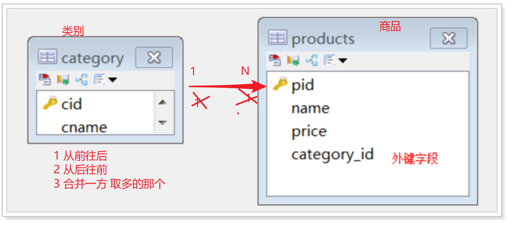

```sql
# 类别表
create table category(
	cid int primary key auto_increment,
	cname varchar(32)
);

# 商品表
create table product(
	pid int primary key auto_increment,
	pname varchar(32),
	price int,
	category_id int
);

# 1 向分类表添加数据
insert into category values(1,'电脑');
insert into category values(2,'手机');

# 2 向商品表添加数据
insert into product values(null, '华为荣耀9', 2000, 2);
# 插入3号类别 是否合理?
insert into product values(null, '联想y7000P', 5000, 3);

# 3 删除分类表的数据
delete from category where cid = 1;
# 删除2号类别 是否合理?
delete from category where cid = 2;
```


现在我们有两张表“分类表”和“商品表”，为了表明商品属于哪个分类，通常情况下，我们将在商品表上添加一列，用于存放分类cid的信息，此列称为：外键

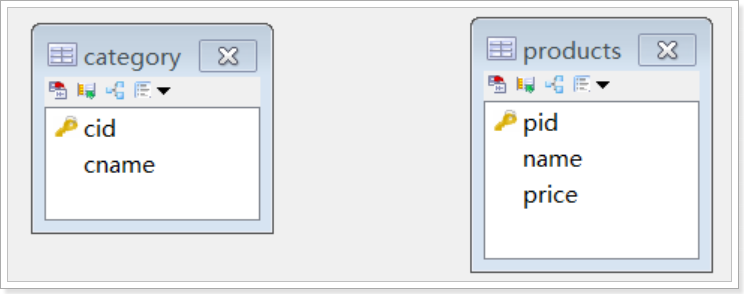


​         此时“分类表category”称为：主表，“cid”我们称为主键。“商品表products”称为：从表，category_id称为外键。我们通过主表的主键和从表的外键来描述主外键关系，就这让表与表之间产生了关系。

- 外键特点：
  - 从表外键的值是对主表主键的引用。
  - 从表外键类型，必须与主表主键类型一致。

- 声明外键约束         

```mysql
语法：
alter table 从表 add [constraint][外键名称] foreign key (从表外键字段名) references 主表 (主表的主键);

[外键名称]用于删除外键约束的，一般建议“_fk”结尾
alter table 从表 drop foreign key 外键名称
```

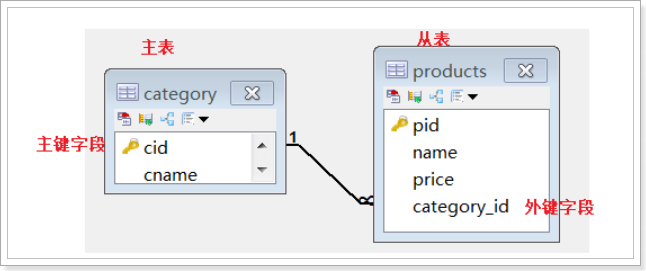

- 使用外键目的：

  - 保证数据完整性

    - 要考虑从表添加数据

    - 要考虑主键删除数据

      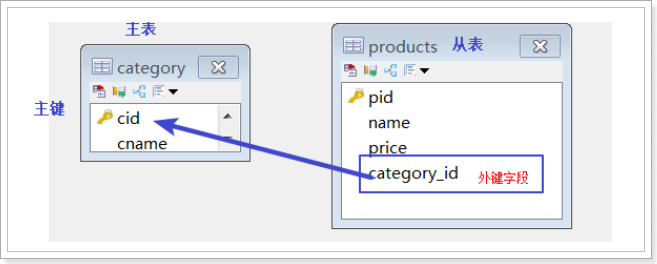


```sql
# 类别表
create table category(
	cid int primary key auto_increment,
	cname varchar(32)
);

# 商品表
create table product(
	pid int primary key auto_increment,
	pname varchar(32),
	price int,
	category_id int
);

# 添加外键
alter table product 
add constraint fk_product_category foreign key (category_id) references category(cid);

# 1 向分类表添加数据
insert into category values(1,'电脑');
insert into category values(2,'手机');

# 2 向商品表添加数据
# 成功
insert into product values(null, '华为荣耀9', 2000, 2);
# 失败: 因为有了外键约束, 外键的值 必须是主表存在的
insert into product values(null, '联想y7000P', 5000, 3);

# 3 删除分类表的数据
# 成功
delete from category where cid = 1;
# 失败 : 因为存在外键约束, 必须删除从表 商品表的依赖关系, 才可以删除主表的数据
delete from category where cid = 2;
```


## 2 表与表之间的关系

实际开发中，一个项目通常需要很多张表才能完成。例如：一个商城项目就需要分类表(category)、商品表(products)、订单表(orders)等多张表。且这些表的数据之间存在一定的关系，接下来我们将在单表的基础上，一起学习多表方面的知识。


- 一对多关系：

  - 常见实例：客户和订单，分类和商品，部门和员工, 省份和城市

  - 一对多建表原则：在从表(多方)创建一个字段，字段作为外键指向主表(一方)的主键.

    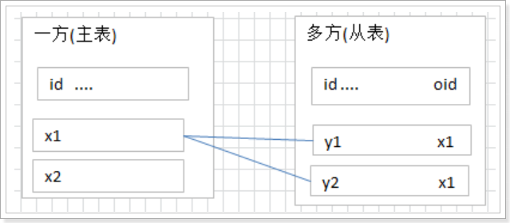

- 多对多关系：

  - 常见实例：学生和课程、用户和角色, 演员和电影, 商品和订单

  - 多对多关系建表原则：需要创建第三张表,中间表中至少两个字段，这两个字段分别作为外键指向各自一方的主键.

    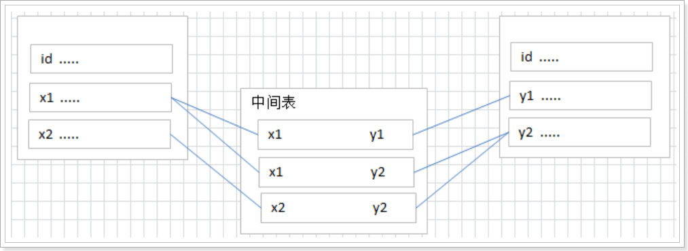

- 一对一关系：

  - 在实际的开发中应用不多.因为一对一可以创建成一张表.

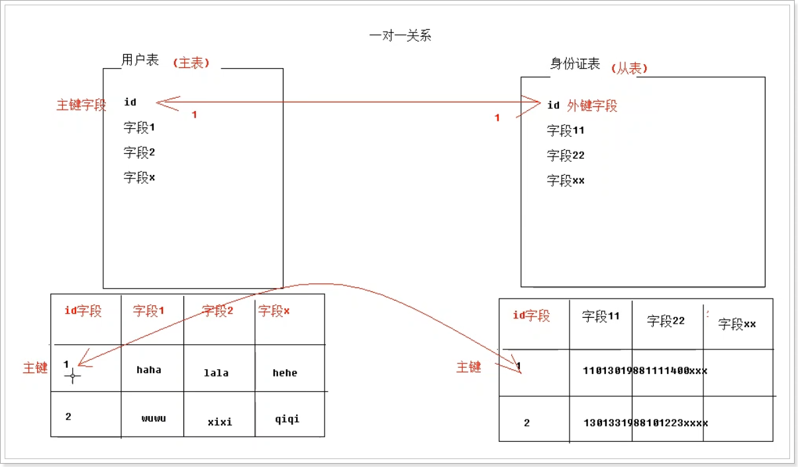


## 3 一对多操作

### 分析

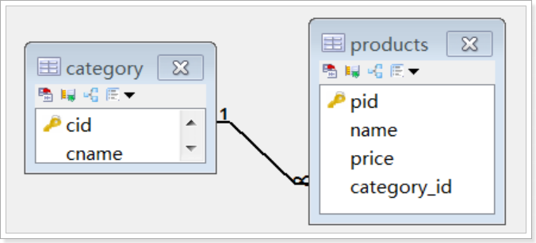

- category分类表，为一方，也就是主表，必须提供主键cid
- products商品表，为多方，也就是从表，必须提供外键category_id

### 实现：分类和商品

```mysql
#创建分类表
create table category(
  cid varchar(32) PRIMARY KEY ,
  cname varchar(100) -- 分类名称
);

# 商品表
CREATE TABLE `products` (
  `pid` varchar(32) PRIMARY KEY  ,
  `name` VARCHAR(40) ,
  `price` DOUBLE 
);

#添加外键字段
alter table products add column category_id varchar(32);

#添加约束
alter table products add constraint product_fk foreign key (category_id) references category (cid);
```

### 操作

```mysql
#1 向分类表中添加数据
INSERT INTO category (cid ,cname) VALUES('c001','服装');

#2 向商品表添加普通数据,没有外键数据，默认为null
INSERT INTO products (pid,pname) VALUES('p001','商品名称');

#3 向商品表添加普通数据，含有外键信息(category表中存在这条数据)
INSERT INTO products (pid ,pname ,category_id) VALUES('p002','商品名称2','c001');

#4 向商品表添加普通数据，含有外键信息(category表中不存在这条数据) -- 失败,异常
INSERT INTO products (pid ,pname ,category_id) VALUES('p003','商品名称2','c999');

#5 删除指定分类(分类被商品使用) -- 执行异常
DELETE FROM category WHERE cid = 'c001';
```

## 4 多对多操作

### 分析


- 商品和订单多对多关系，将拆分成两个一对多。
- products商品表，为其中一个一对多的主表，需要提供主键pid
- orders 订单表，为另一个一对多的主表，需要提供主键oid
- orderitem中间表，为另外添加的第三张表，需要提供两个外键oid和pid, 用来维护商品与分类的关系

### 实现：订单和商品

```mysql
#商品表[已存在]

#订单表
create table `orders`(
  `oid` varchar(32) PRIMARY KEY ,
  `totalprice` double 	#总计
);

#订单项表
create table orderitem(
  oid varchar(50),-- 订单id
  pid varchar(50)-- 商品id
);

#订单表和订单项表的主外键关系
alter table `orderitem` add constraint orderitem_orders_fk foreign key (oid) references orders(oid);

#商品表和订单项表的主外键关系
alter table `orderitem` add constraint orderitem_product_fk foreign key (pid) references products(pid);

#联合主键（可省略）
alter table `orderitem` add primary key (oid,pid);
```


add constraint 别名 foreign key (当前表的关联字段) references products(主表的关联字段);

### 操作

```mysql
#1 向商品表中添加数据
insert into products values('p004', '锤子手机', 2999, 'c002');

#2 向订单表中添加数据
INSERT into orders values('o001', 5000);
INSERT into orders values('o002', 8000);

#3向中间表添加数据(数据存在)
insert into orderitem(oid,pid) values('o001', 'p001');
insert into orderitem(oid,pid) values('o001', 'p002');
insert into orderitem(oid,pid) values('o002', 'p001');

#4删除中间表的数据(数据存在)
delete from orderitem where oid='o001' and pid='p001';

#5向中间表添加数据(数据不存在) -- 执行异常
insert into orderitem(oid,pid) values('o002', 'p099'); -- 商品表pid数据不存在
insert into orderitem(oid,pid) values('o099', 'p001'); -- 订单表oid数据不存在

#6删除商品表的数据 -- 执行异常
delete from products where pid='p001';
```


# 第二章 多表关系实战

## 1 实战1：省和市

- 方案1：多张表，一对多


```sql
-- 创建省份表
create table province(
	pid int PRIMARY KEY,
	pname varchar(32), -- 省份名称
	description varchar(100) -- 描述
);

-- 创建城市表
create table city (
	cid int PRIMARY KEY,
	cname varchar(32), -- 城市名称
	description varchar(100), -- 描述
	province_id int,
	CONSTRAINT city_province_fk foreign key(province_id) references province(pid)
);
```


- 方案2：一张表，自关联一对多(扩展)


```sql
create table area (
	id int PRIMARY key AUTO_INCREMENT,
	`name` varchar(32),
	description varchar(100),
	parent_id int,
	CONSTRAINT area_area_fk FOREIGN KEY(parent_id) REFERENCES area(id)
);

INSERT into area values(null, '辽宁省', '这是一个省份', null);
INSERT into area values(null, '大连市', '这是一个城市', 1);
INSERT into area values(null, '沈阳市', '这是一个城市', 1);
INSERT into area values(null, '河北省', '这是一个省份', null);
INSERT into area values(null, '石家庄市', '这是一个城市', 4);
INSERT into area values(null, '保定市', '这是一个城市', 4);
```


## 2 实战2：用户和角色

- 多对多关系

  


```sql
-- 用户表
create table `user` (
	uid varchar(32) PRIMARY KEY,
	username varchar(32),
	`password` varchar(32)
);

-- 角色表
create table role (
	rid varchar(32) PRIMARY KEY,
	rname varchar(32)
);

-- 中间表
create table user_role(
	user_id varchar(32),
	role_id varchar(32),
	CONSTRAINT user_role_pk PRIMARY KEY(user_id,role_id),
	CONSTRAINT user_id_fk FOREIGN KEY(user_id) REFERENCES `user`(uid),
	CONSTRAINT role_id_fk FOREIGN KEY(role_id) REFERENCES role(rid)
);

```


# 第三章 多表查询 重点重点重点

**提供表结构如下：**


```mysql
# 分类表
CREATE TABLE category (
  cid VARCHAR(32) PRIMARY KEY ,
  cname VARCHAR(50)
);

#商品表
CREATE TABLE products(
  pid VARCHAR(32) PRIMARY KEY ,
  pname VARCHAR(50),
  price INT,
  flag VARCHAR(2), #是否上架标记为：1表示上架、0表示下架
  category_id VARCHAR(32),
  CONSTRAINT products_category_fk FOREIGN KEY (category_id) REFERENCES category (cid)
);
```

## 1 初始化数据

```mysql
#分类
INSERT INTO category(cid,cname) VALUES('c001','家电');
INSERT INTO category(cid,cname) VALUES('c002','服饰');
INSERT INTO category(cid,cname) VALUES('c003','化妆品');
#商品
INSERT INTO products(pid, pname,price,flag,category_id) VALUES('p001','联想',5000,'1','c001');
INSERT INTO products(pid, pname,price,flag,category_id) VALUES('p002','海尔',3000,'1','c001');
INSERT INTO products(pid, pname,price,flag,category_id) VALUES('p003','雷神',5000,'1','c001');

INSERT INTO products (pid, pname,price,flag,category_id) VALUES('p004','JACK JONES',800,'1','c002');
INSERT INTO products (pid, pname,price,flag,category_id) VALUES('p005','真维斯',200,'1','c002');
INSERT INTO products (pid, pname,price,flag,category_id) VALUES('p006','花花公子',440,'1','c002');
INSERT INTO products (pid, pname,price,flag,category_id) VALUES('p007','劲霸',2000,'1','c002');

INSERT INTO products (pid, pname,price,flag,category_id) VALUES('p008','香奈儿',800,'1','c003');
INSERT INTO products (pid, pname,price,flag,category_id) VALUES('p009','相宜本草',200,'1','c003');
```

## 2 多表查询

#### 交叉连接查询(开发中不使用-得到的是两个表的乘积) [了解]

- 语法：`select * from A,B;`

```sql
select * from category,products ORDER BY cid, pid;
```

- 效果: category表中每条记录,  与 products表中每条记录分别连接

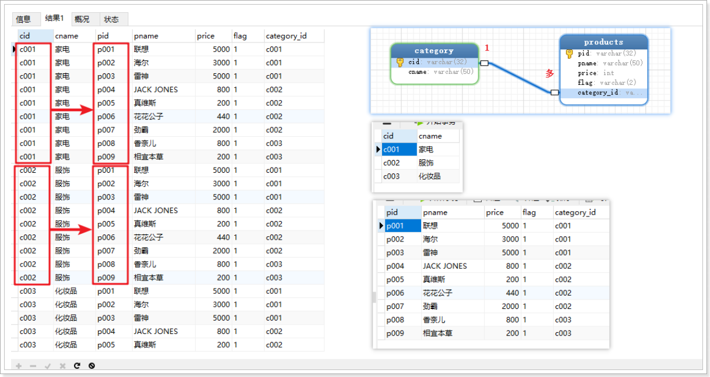

```sql
-- 上课代码
-- 两张表排列组合的结果 称之为 笛卡尔积
-- 问题: 存在很多错误的数据
select * from products, category
where products.category_id=category.cid;

-- 问题: 太长 解决: 别名
select * from products as p, category as c
where p.category_id=c.cid;

select * from products  p, category  c
where p.category_id=c.cid;

select p.pname, c.cname from products  p, category  c
where p.category_id=c.cid;
```


#### 下面通过一张图说明常用的多表查询方式:

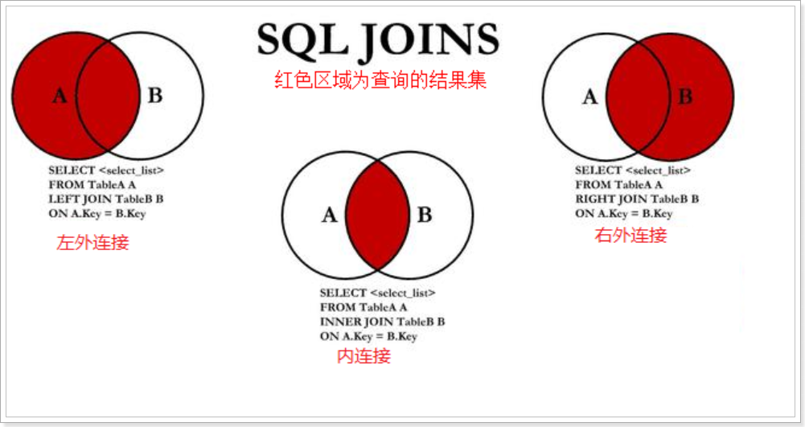


#### 内连接查询(使用的关键字 inner join  -- inner可以省略)

- 隐式内连接：`select * from A,B where 条件;`

- 显示内连接：`select * from A inner join B on 条件;`

```mysql
-- 查询那些分类的商品已经上架
-- 隐式内连接
SELECT DISTINCT
	c.cname
FROM
	category c,
	products p
WHERE
	c.cid = p.category_id;

-- 显示内连接
SELECT DISTINCT
	c.cname
FROM
	category c INNER JOIN products p 
ON 
	c.cid = p.category_id;
```

- 效果

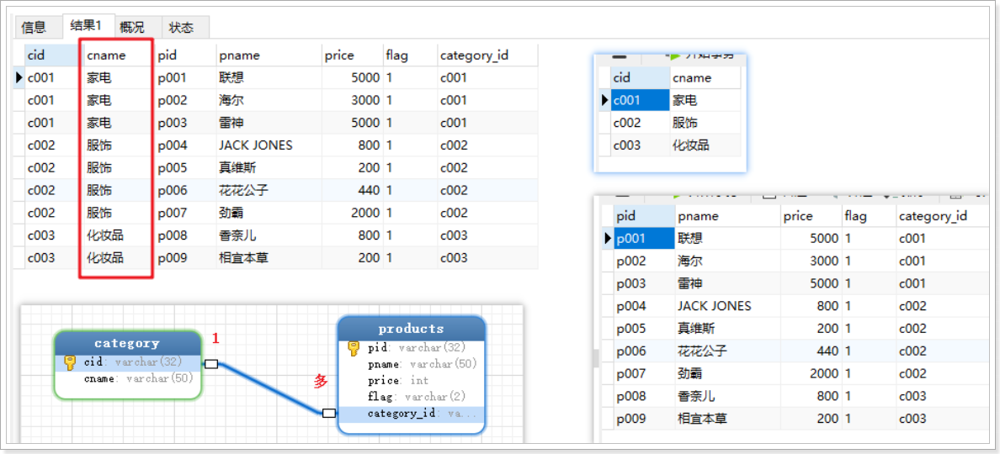


#### 外连接查询(使用的关键字 outer join -- outer可以省略)

- 左外连接：left outer join
  - `select * from A left outer join B on 条件;`
- 右外连接：right outer join
  - `select * from A right outer join B on 条件;`

```mysql
#2.查询所有分类商品的个数
#左外连接
INSERT INTO category(cid,cname) VALUES('c004','奢侈品');

SELECT cname,COUNT(category_id) 
FROM category c LEFT OUTER JOIN products p 
ON c.cid = p.category_id 
GROUP BY cname;
```

- 效果

  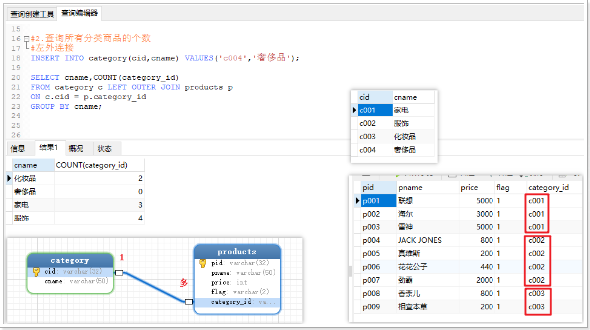


## 3 子查询

```http
需求1:查询归属于化妆品的商品
需求2:查询归属于化妆品和家电的商品
```


**子查询**：一条select语句结果作为另一条select语法一部分（查询条件，查询结果，表等）。
**语法**：`select ....查询字段 ... from ... 表.. where ... 查询条件`

```mysql
-- 子查询, 查询“化妆品”分类上架商品详情

-- 内连接
select 
	p.*
from 
	category c, products p
WHERE
	c.cid = p.category_id and c.cname = '化妆品'


-- 子查询 第一种(作为查询条件值使用)
select 
	* 
from
	products p
where
	p.category_id = (SELECT cid from category where cname='化妆品') -- 'c003'

-- SELECT cid from category where cname='化妆品';


-- 子查询 第二种(作为 一张表 使用)
select 
	p.*
FROM
	products p, (select * from category where cname='化妆品') c
WHERE
	p.category_id = c.cid;


-- select * from category where cname='化妆品'
```

- 效果

  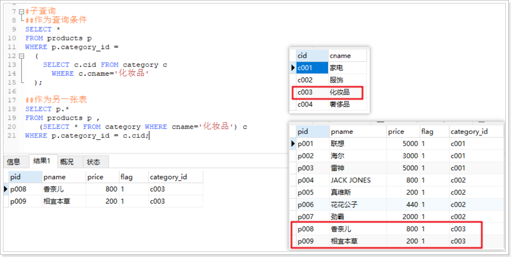


**子查询练习：**

```mysql
#查询“化妆品”和“家电”两个分类上架商品详情
select
	*
from 
	products 
WHERE
	category_id in (select cid from category where cname='家电' or cname='化妆品');  -- 'c001', 'c003'


-- select cid from category where cname='家电' or cname='化妆品';
-- select cid from category where cname in ('家电', '化妆品');
```

- 效果

  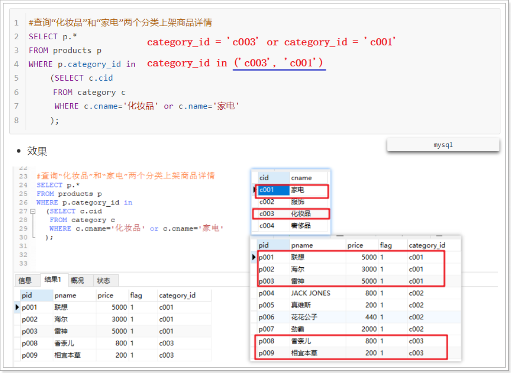


敢比会重要

积极

# 第四章 索引

## 1 索引概述

MySQL官方对索引的定义为：索引（index）是帮助MySQL高效获取数据的数据结构（有序）。在数据之外，数据库系统还维护者满足特定查找算法的数据结构，这些数据结构以某种方式引用（指向）数据， 这样就可以在这些数据结构上实现高级查找算法，这种数据结构就是索引。如下面的==示意图==所示 : 


左边是数据表，一共有两列七条记录，最左边的是数据记录的物理地址（注意逻辑上相邻的记录在磁盘上也并不是一定物理相邻的）。为了加快Col2的查找，可以维护一个右边所示的二叉查找树，每个节点分别包含索引键值和一个指向对应数据记录物理地址的指针，这样就可以运用二叉查找快速获取到相应数据。

一般来说索引本身也很大，不可能全部存储在内存中，因此索引往往以索引文件的形式存储在磁盘上。索引是数据库中用来提高性能的最常用的工具。


## 2 索引优势劣势

优势

1） 类似于书籍的目录索引，提高数据检索的效率，降低数据库的IO成本。

2） 通过索引列对数据进行排序，降低数据排序的成本，降低CPU的消耗。

劣势

1） 实际上索引也是一张表，该表中保存了主键与索引字段，并指向实体类的记录，所以索引列也是要占用空间的。

2） 虽然索引大大提高了查询效率，同时却也降低更新表的速度，如对表进行INSERT、UPDATE、DELETE。因为更新表时，MySQL 不仅要保存数据，还要保存一下索引文件每次更新添加了索引列的字段，都会调整因为更新所带来的键值变化后的索引信息。


## 3 索引结构

索引是在MySQL的存储引擎层中实现的，而不是在服务器层实现的。所以每种存储引擎的索引都不一定完全相同，也不是所有的存储引擎都支持所有的索引类型的。MySQL目前提供了以下4种索引：

- BTREE 索引 ： 最常见的索引类型，大部分索引都支持 B 树索引。
- HASH 索引：只有Memory引擎支持 ， 使用场景简单 。
- R-tree 索引（空间索引）：空间索引是MyISAM引擎的一个特殊索引类型，主要用于地理空间数据类型，通常使用较少，不做特别介绍。
- Full-text （全文索引） ：全文索引也是MyISAM的一个特殊索引类型，主要用于全文索引，InnoDB从Mysql5.6版本开始支持全文索引。

MyISAM、InnoDB、Memory三种存储引擎对各种索引类型的支持

| 索引        | InnoDB引擎      | MyISAM引擎 | Memory引擎 |
| ----------- | --------------- | ---------- | ---------- |
| BTREE索引   | 支持            | 支持       | 支持       |
| HASH 索引   | 不支持          | 不支持     | 支持       |
| R-tree 索引 | 不支持          | 支持       | 不支持     |
| Full-text   | 5.6版本之后支持 | 支持       | 不支持     |

我们平常所说的索引，如果没有特别指明，都是指B+树（多路搜索树，并不一定是二叉的）结构组织的索引。其中聚集索引、复合索引、前缀索引、唯一索引默认都是使用 B+tree 索引，统称为 索引。

## 4 索引分类

1） 单值索引 ：即一个索引只包含单个列，一个表可以有多个单列索引

2） 唯一索引 ：索引列的值必须唯一，但允许有空值

3） 复合索引 ：即一个索引包含多个列

## 5 索引语法

索引在创建表的时候，可以同时创建， 也可以随时增加新的索引。

准备环境:

```sql
CREATE TABLE `city` (
  `city_id` int(11) NOT NULL AUTO_INCREMENT,
  `city_name` varchar(50) NOT NULL,
  `country_id` int(11) NOT NULL,
  PRIMARY KEY (`city_id`)
) ENGINE=InnoDB DEFAULT CHARSET=utf8;

CREATE TABLE `country` (
  `country_id` int(11) NOT NULL AUTO_INCREMENT,
  `country_name` varchar(100) NOT NULL,
  PRIMARY KEY (`country_id`)
) ENGINE=InnoDB DEFAULT CHARSET=utf8;


insert into `city` (`city_id`, `city_name`, `country_id`) values(1,'西安',1);
insert into `city` (`city_id`, `city_name`, `country_id`) values(2,'NewYork',2);
insert into `city` (`city_id`, `city_name`, `country_id`) values(3,'北京',1);
insert into `city` (`city_id`, `city_name`, `country_id`) values(4,'上海',1);

insert into `country` (`country_id`, `country_name`) values(1,'China');
insert into `country` (`country_id`, `country_name`) values(2,'America');
insert into `country` (`country_id`, `country_name`) values(3,'Japan');
insert into `country` (`country_id`, `country_name`) values(4,'UK');
```


### 5.1 创建索引

语法 ： 	

```sql
CREATE 	[UNIQUE|FULLTEXT|SPATIAL]  INDEX index_name 
[USING  index_type]
ON tbl_name(index_col_name,...)


index_col_name : column_name[(length)][ASC | DESC]
```

示例 ： 为city表中的city_name字段创建索引 ；

	

### 5.2 查看索引

语法： 

```
show index  from  table_name;
```

示例：查看city表中的索引信息；

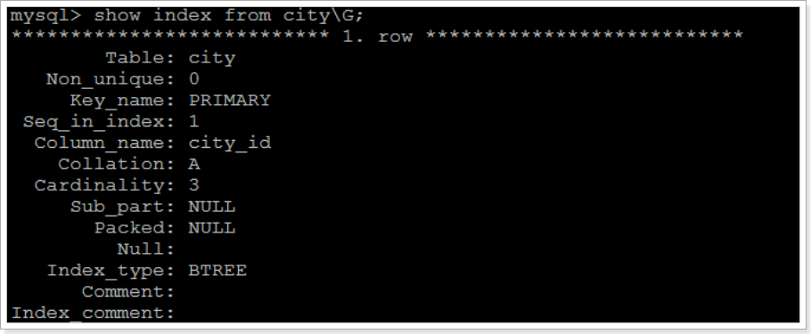

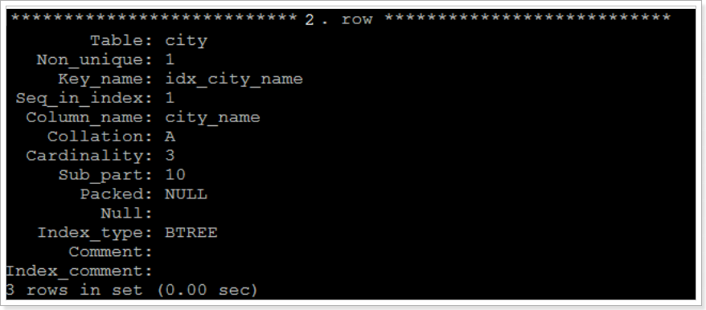

### 5.3 删除索引

语法 ：

```
DROP  INDEX  index_name  ON  tbl_name;
```

示例 ： 想要删除city表上的索引idx_city_name，可以操作如下：


### 5.4 ALTER命令

```
1). alter  table  tb_name  add  primary  key(column_list); 

	该语句添加一个主键，这意味着索引值必须是唯一的，且不能为NULL
	
2). alter  table  tb_name  add  unique index_name(column_list);
	
	这条语句创建索引的值必须是唯一的（除了NULL外，NULL可能会出现多次）
	
3). alter  table  tb_name  add  index index_name(column_list);

	添加普通索引， 索引值可以出现多次。
```

# 第五章 JDBC 重点重点重点

## 1 JDBC概述

JDBC（Java DataBase Connectivity,java数据库连接）是一种用于执行SQL语句的Java API。JDBC是Java访问数据库的标准规范，可以为不同的关系型数据库提供统一访问，它由一组用Java语言编写的接口和类组成。

JDBC需要连接驱动，驱动是两个设备要进行通信，满足一定通信数据格式，数据格式由设备提供商规定，设备提供商为设备提供驱动软件，通过软件可以与该设备进行通信。今天我们使用的是mysql的驱动`mysql-connector-java-5.1.37-bin.jar`

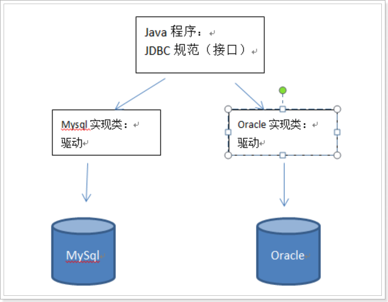

**JDBC规范（掌握四个核心对象）：**

- DriverManager:用于注册驱动
- Connection: 表示与数据库创建的连接
- Statement: 操作数据库sql语句的对象
- ResultSet: 结果集或一张虚拟表

## 2 JDBC原理

Java提供访问数据库规范称为JDBC，而生产厂商提供规范的实现类称为驱动。

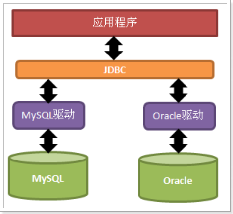

JDBC是接口，驱动是接口的实现，没有驱动将无法完成数据库连接，从而不能操作数据库！每个数据库厂商都需要提供自己的驱动，用来连接自己公司的数据库，也就是说驱动一般都由数据库生成厂商提供。

## 3 JDBC入门案例

### 准备数据

之前我们学习了sql语句的使用，并创建的分类表category，今天我们将使用JDBC对分类表进行增删改查操作。

```sql
-- 创建表
create table users(
	uid int primary key auto_increment,
	username varchar(32) not null unique,
	password varchar(32) not null,
	nickname varchar(32)
);

-- 插入数据
insert into users values(null,'zhangsan','123','张三'), (null,'lisi','123','李四'), (null,'wangwu','123','王五');
```

### 导入驱动jar包

创建lib目录，存放mysql的驱动mysql-connector-java-5.1.37-bin.jar

选中mysql的jar包，右键选择“ Add as Library...” 完成jar导入

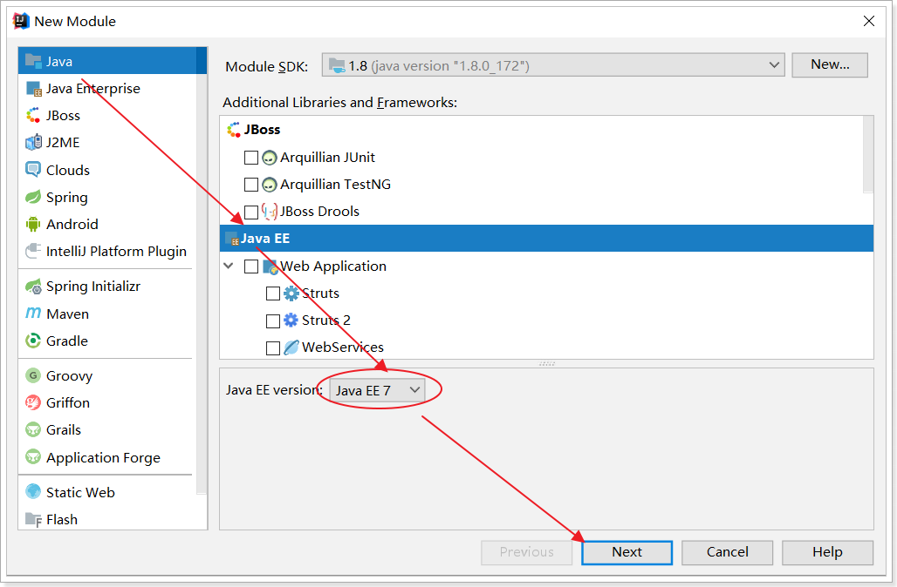


### 开发步骤

1. 注册驱动.
2. 获得连接.
3. 获得执行sql语句的对象
4. 执行sql语句，并返回结果
5. 处理结果
6. 释放资源.

### 案例实现

```java
public static void main(String[] args) throws Exception {
        /**
         * 1.注册驱动
         * 2.获得连接
         * 3.获取执行sql语句的对象
         * 4.执行sql语句, 并返回结果
         * 5.处理结果
         * 6.释放资源
         */

        //1.注册驱动,  就是把 Driver.class　文件　加载到内存
        Class.forName("com.mysql.jdbc.Driver");

        /**
         *   2.获得连接
         *   参数 url : 需要连接数据库的地址  jdbc:mysql://IP地址:端口号/要连接的数据库名称
         *   参数user : 连接数据库 使用的用户名
         *   参数password: 连接数据库 使用的密码
         */
        String url = "jdbc:mysql://localhost:3306/day03_db";
        Connection conn = DriverManager.getConnection(url, "root", "root");
        System.out.println("conn = " + conn);

        //3.获取执行sql语句的对象
        String sql = "select * from users";
        PreparedStatement stmt = conn.prepareStatement(sql);

        //4.执行sql语句, 并返回结果
        ResultSet rs = stmt.executeQuery();
        System.out.println("rs = " + rs);

        //5.处理结果
        while (rs.next()) {
            //int uid = rs.getInt(1); // 通过列的位置 获取值
            //int uid2 = rs.getInt("cid"); //通过列的名称 获取值
            int uid = rs.getInt("uid");
            String username = rs.getString("username");
            String password = rs.getString("password");
            String nickname = rs.getString("nickname");

            System.out.println("uid = " + uid + ", username = " + username + ", password = " + password + ", nickname = " + nickname);
        }

        //6.释放资源
        rs.close();
        stmt.close();
        conn.close();
    }
```

## 4 API详解

### API详解：注册驱动

`DriverManager.registerDriver(new com.mysql.jdbc.Driver());`不建议使用，原因有2个：

- 导致驱动被注册2次
- 强烈依赖数据库的驱动jar

解决办法：

- `Class.forName("com.mysql.jdbc.Driver");`

### API详解：获得链接

`static Connection getConnection(String url, String user, String password)`:试图建立到给定数据库 URL 的连接。

- 参数说明：
  - url 需要连接数据库的位置（网址）
  - user用户名
  - password 密码
- 例如：`getConnection("jdbc:mysql://localhost:3306/day03_db", "root", "root");`

> 扩展：
>
> URL: SUN公司与数据库厂商之间的一种协议。
>
> ```
> jdbc:mysql://localhost:3306/day03_db
> ```
>
> 协议子协议 IP :端口号数据库	mysql数据库: jdbc:mysql://localhost:3306/day04 或者 jdbc:mysql:///day04（默认本机连接）	oracle数据库: jdbc:oracle:thin:@localhost:1521:sid

### API详解：java.sql.Connection接口：一个连接

接口的实现在数据库驱动中。所有与数据库交互都是基于连接对象的。

- `Statement createStatement();`//创建操作sql语句的对象

### API详解：java.sql.PreparedStatement接口: 操作sql语句，并返回相应结果

```
String sql = "某SQL语句";
获取Statement语句执行平台：PreparedStatement stmt = conn.prepareStatement(sql);
```

常用方法：

- `int executeUpdate();`--执行insert update delete语句.

- `ResultSet executeQuery();` --执行select语句.

- `boolean execute();` --仅当执行select并且有结果时才返回true，执行其他的语句返回false.

### API详解：处理结果集（注：执行insert、update、delete无需处理）

ResultSet实际上就是一张二维的表格，我们可以调用其`boolean next()`方法指向某行记录，当第一次调用`next()`方法时，便指向第一行记录的位置，这时就可以使用ResultSet提供的`getXXX(int col)`方法来获取指定列的数据：(与数组索引从0开始不同，这里索引从1开始)

```
rs.next();//指向第一行
rs.getInt(1);//获取第一行第一列的数据
```

常用方法：

- `Object getObject(int index)` / `Object getObject(String name)` 获得任意对象
- `String getString(int index)` / `String getString(String name)` 获得字符串

- `int getInt(int index)` / `int getInt(String name)` 获得整形
- `double getDouble(int index)` / `double getDouble(String name)`获得双精度浮点型

### API详解：释放资源

与IO流一样，使用后的东西都需要关闭！关闭的顺序是先得到的后关闭，后得到的先关闭。

```
rs.close();
stmt.close();
con.close();
```

## 5 JDBC增删改查操作

### 5.1 查询数据

```java
    //查询操作
    @Test
    public void jdbcTest() throws SQLException {
        //1.通过工具类 获取 Connection对象
        Connection conn = JDBCUtils.getConnection();
        //2.创建 用于执行sql语句的对象 PreparedStatement , 同时指定sql语句
        String sql = "select * from users where username=? and password=?";
        PreparedStatement pstat = conn.prepareStatement(sql);
        //3.为sql语句中的 每个? 号  赋值
        pstat.setString(1,"admin");
        pstat.setString(2,"123");
        //4.执行sql语句
        ResultSet rs = pstat.executeQuery();
        //5.处理 执行sql语句后的 结果
        while(rs.next()){
            int uid = rs.getInt("uid");
            String username = rs.getString("username");
            String password = rs.getString("password");
            System.out.println(uid + "== " +  username + " === " + password);
        }
        //6.释放资源
        JDBCUtils.close(rs, pstat, conn);
    }
```

### 5.2 插入数据

```java
    //插入操作
    @Test
    public void jdbcTest2() throws SQLException {
        /*
        1.通过工具类 获取 Connection对象
        2.创建 用于执行sql语句的对象 PreparedStatement , 同时指定sql语句
        3.为sql语句中的 每个? 号  赋值
        4.执行sql语句
        5.处理 执行sql语句后的 结果
        6.释放资源
         */
        Connection conn = JDBCUtils.getConnection();
        String sql = "insert into users(username, password) values(?, ?)";
        PreparedStatement pstat = conn.prepareStatement(sql);
        //为sql语句中的 每个? 号  赋值
        pstat.setString(1, "lisi");
        pstat.setString(2,"123");
        //执行sql语句
        int line = pstat.executeUpdate();
        System.out.println("line = " + line);
        //释放资源
        JDBCUtils.close(null, pstat, conn);
    }
```

### 5.3 更新

```java
    //更新操作
    @Test
    public void jdbcTest3() throws SQLException {
        /*
        1.通过工具类 获取 Connection对象
        2.创建 用于执行sql语句的对象 PreparedStatement , 同时指定sql语句
        3.为sql语句中的 每个? 号  赋值
        4.执行sql语句
        5.处理 执行sql语句后的 结果
        6.释放资源
         */
        Connection conn = JDBCUtils.getConnection();
        String sql = "update users set password=? where uid=?";
        PreparedStatement pstat = conn.prepareStatement(sql);
        //为sql语句中的 每个? 号  赋值
        pstat.setString(1,"abcdef");
        pstat.setInt(2,3);
        //执行sql语句
        int line = pstat.executeUpdate();
        System.out.println("line = " + line);

        JDBCUtils.close(null, pstat, conn);
    }
```

### 5.4 通过id查询详情

```java
    //根据ID 进行查询
    @Test
    public void jdbcTest4() throws SQLException {
        /*
        1.通过工具类 获取 Connection对象
        2.创建 用于执行sql语句的对象 PreparedStatement , 同时指定sql语句
        3.为sql语句中的 每个? 号  赋值
        4.执行sql语句
        5.处理 执行sql语句后的 结果
        6.释放资源
         */
        //1.通过工具类 获取 Connection对象
        Connection conn = JDBCUtils.getConnection();
        //2.创建 用于执行sql语句的对象 PreparedStatement , 同时指定sql语句
        String sql = "select * from users where uid=?";
        PreparedStatement pstat = conn.prepareStatement(sql);
        //3.为sql语句中的 每个? 号  赋值
        pstat.setInt(1,3);
        //4.执行sql语句
        ResultSet rs = pstat.executeQuery();
        //5.处理 执行sql语句后的 结果
        while(rs.next()){
            int uid = rs.getInt("uid");
            String username = rs.getString("username");
            String password = rs.getString("password");
            System.out.println(uid + "== " +  username + " === " + password);
        }
        //6.释放资源
        JDBCUtils.close(rs, pstat, conn);

    }
```

 

# 第六章 JDBC工具类

“获得数据库连接”操作，将在以后的增删改查所有功能中都存在，可以封装工具类JDBCUtils。提供获取连接对象的方法，从而达到代码的重复利用。

该工具类提供方法：`public static Connection getConnection()`。代码如下：

- jdbc.properties文件

```
jdbc.driver=com.mysql.jdbc.Driver
jdbc.url=jdbc:mysql://localhost:3306/day03_db
jdbc.user=root
jdbc.password=root
```

- JDBC工具类

```java
public class JDBCUtils2 {
    private static String driver;
    private static String url;
    private static String user;
    private static String password;

    static {
        try {
            //使用类加载器, 读取配置文件
            InputStream is = JDBCUtils2.class.getClassLoader().getResourceAsStream("jdbc.properties");
            Properties prop = new Properties();
            prop.load(is);

            driver = prop.getProperty("jdbc.driver");
            url = prop.getProperty("jdbc.url");
            user = prop.getProperty("jdbc.user");
            password = prop.getProperty("jdbc.password");

            //注册驱动
            Class.forName(driver);
        } catch (IOException e) {
            e.printStackTrace();
        } catch (ClassNotFoundException e) {
            e.printStackTrace();
        }
    }

    /**
     * 返回连接对象 Connection
     */
    public static Connection getConnection() throws SQLException {
       Connection conn = DriverManager.getConnection(url, user, password);
       return conn;
    }

    /**
     * 释放资源
     */
    public static void close(ResultSet rs, Statement stat, Connection conn) throws SQLException {
        if (rs != null) {
            rs.close();
        }
        if (stat != null) {
            stat.close();
        }
        //看Connection来自哪里, 如果Connection是从连接池里面获得的, close()方法其实是归还; 如果Connection是创建的, 就是销毁
        if (conn != null) {
            conn.close();
        }
    }
}
```

- 使用JDBC工具类 完成查询

```java
	@Test
    public void testJDBC6() throws ClassNotFoundException, Exception {
        //1.注册驱动,  就是把 Driver.class　文件　加载到内存
        Connection conn = JDBCUtils.getConnection();

        //3.获取执行sql语句的对象
        String sql = "select * from users";
        PreparedStatement stmt = conn.prepareStatement(sql);

        //4.执行sql语句, 并返回结果
        ResultSet rs = stmt.executeQuery();

        //5.处理结果
        while (rs.next()) {
            int uid = rs.getInt("uid");
            String username = rs.getString("username");
            String password = rs.getString("password");
            String nickname = rs.getString("nickname");

            System.out.println("uid = " + uid + ", username = " + username + ", password = " + password + ", nickname = " + nickname);
        }

        //6.释放资源
        JDBCUtils.close(rs, stmt, conn);
    }
```

 