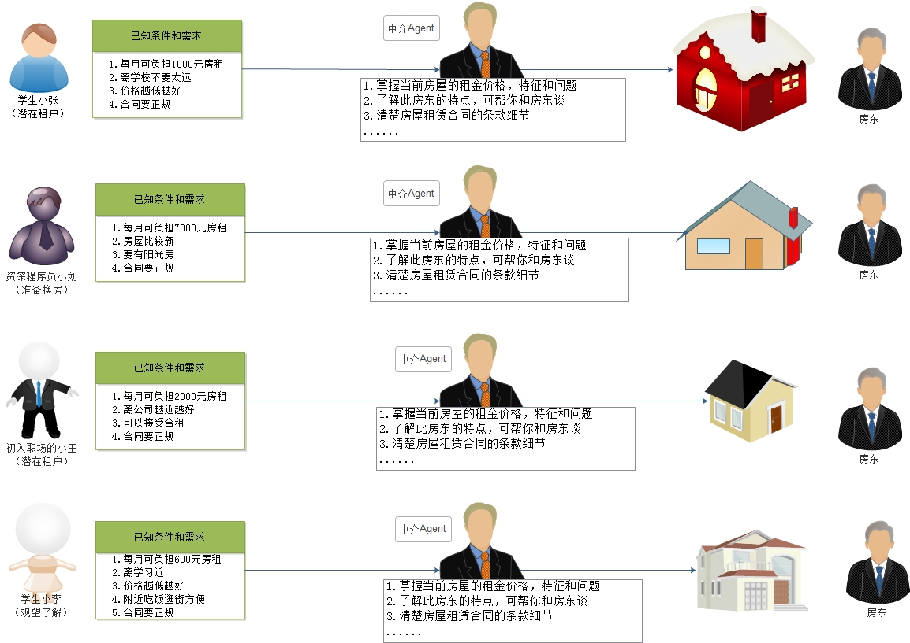
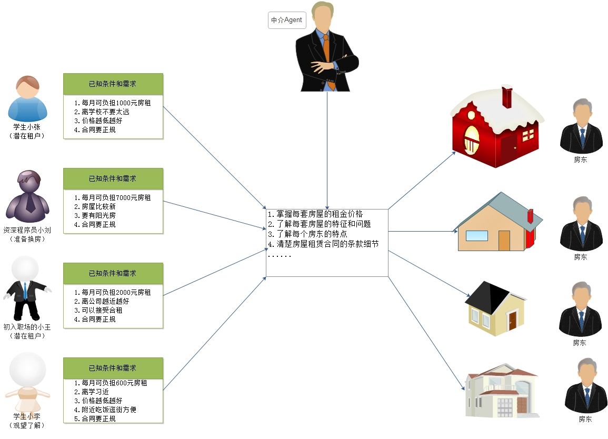
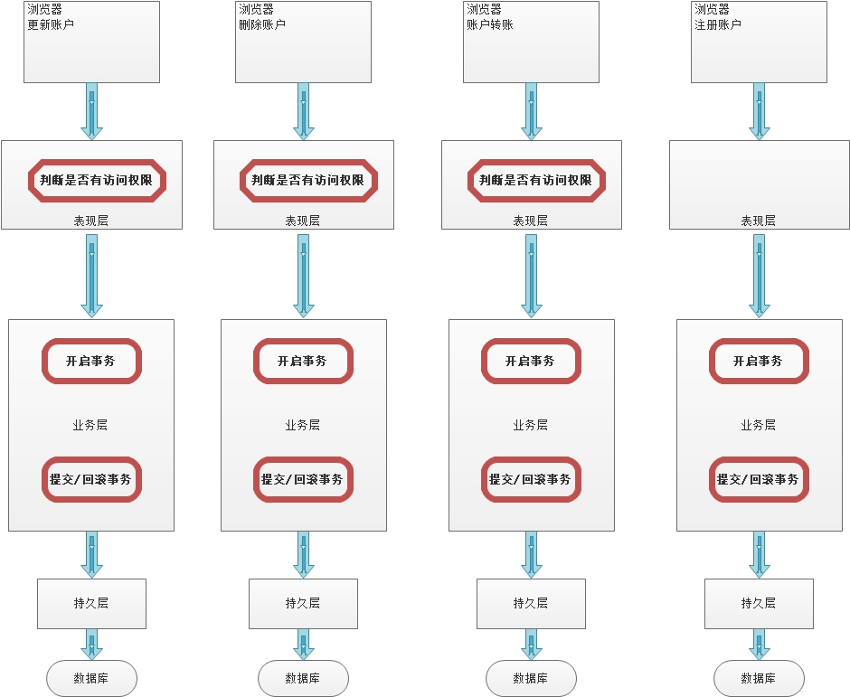
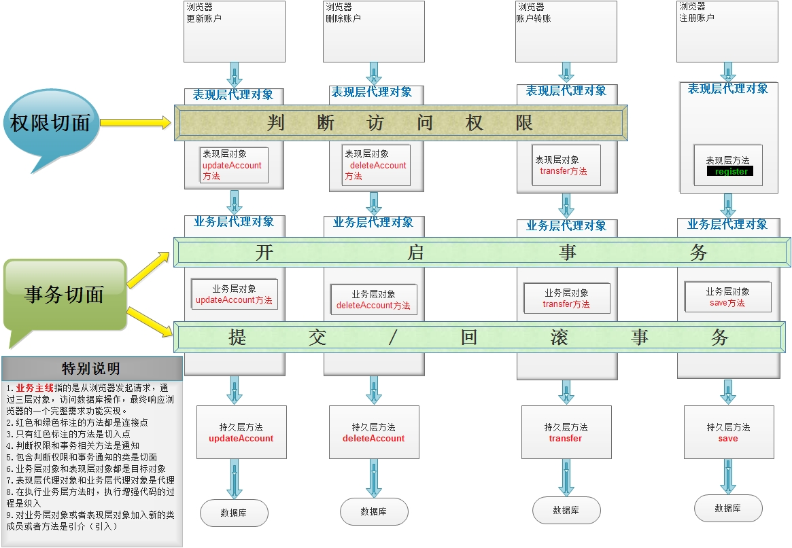
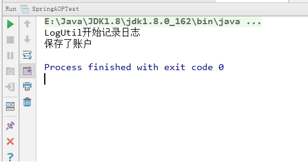
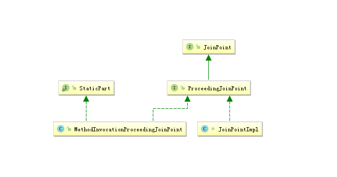

# 1 初识AOP

## 1.1 AOP概述

AOP：全称是Aspect Oriented Programming。即：面向切面编程。

它是把我们业务逻辑中的各个部分进行隔离，使每个部分独立开来，在需要用到某个部分的时候，运用预编译和运行期动态代理技术把增强的代码加入到我们的业务逻辑中，组成完整的功能。

它是一种编程思想，一种设计理念，是OOP的一种延续。运用AOP编程思想，可以提高代码的可重用性，使编码更加简洁，更易于维护。

简单的说它就是把我们程序重复的代码抽取出来，在需要执行的时候，使用动态代理的技术，在不修改源码的基础上，对我们的已有方法进行增强。

## 1.2 AOP的使用场景

### 1.2.1 案例问题回顾

在Spring的注解IoC课程的案例中，我们通过账户操作的综合案例把IoC课程内容串联起来了，但是当我们加入了转账功能后，代码变得不再简洁。我们的故事就从这里开始。

代码节选如下：（只保留了业务层代码，主要问题就在业务层实现类中）

```java
/**
 * 账户的业务层接口
 */
public interface AccountService {

    /**
     * 转账
     */
    void transfer(String source, String target, double money);

    /**
     * 保存
     */
    void save(Account account);

    /**
     * 根据id删除
     */
    void delete(Integer id);

    /**
     * 更新账户
     */
    void update(Account account);

    /**
     * 根据id查询
     */
    Account findById(Integer id);

    /**
     * 根据名称查询账户
     */
    Account findByName(String name);

    /**
     * 查询所有
     */
    List<Account> findAll();
}
```

```java
/*
业务层接口实现类
 */
@Service("accountService")
public class AccountServiceImpl implements AccountService {

    //依赖注入
    @Autowired
    private AccountDao accountDao;
    @Autowired
    private TransactionManager transactionManager;

    //转账
    @Override
    public void transfer(String source, String target, double money) {
        try {
            //开启事务
            transactionManager.begin();

            //1.根据名称查询转出账户
            Account sourceAccount = accountDao.findByName(source);
            //2.根据名称查询转入账户
            Account targetAccount = accountDao.findByName(target);
            //3.转出账户减钱
            sourceAccount.setMoney(sourceAccount.getMoney() - money);
            //4.转入账户加钱
            targetAccount.setMoney(targetAccount.getMoney() + money);
            //5.更新转出账户
            accountDao.update(sourceAccount);
            int i=1/0;//模拟转账异常
            //6.更新转入账户
            accountDao.update(targetAccount);

            //提交事务
            transactionManager.commit();
        }catch (Exception e){
            //回滚事务
            transactionManager.rollback();
            e.printStackTrace();
        }finally {
            //释放连接
            transactionManager.close();
        }
    }

    @Override
    public void save(Account account) {
        try {
            //开启事务
            transactionManager.begin();

            accountDao.save(account);

            //提交事务
            transactionManager.commit();
        }catch (Exception e){
            //回滚事务
            transactionManager.rollback();
            e.printStackTrace();
        }finally {
            //释放连接
            transactionManager.close();
        }
    }

    @Override
    public void delete(Integer id) {
        try {
            //开启事务
            transactionManager.begin();

            accountDao.delete(id);

            //提交事务
            transactionManager.commit();
        }catch (Exception e){
            //回滚事务
            transactionManager.rollback();
            e.printStackTrace();
        }finally {
            //释放连接
            transactionManager.close();
        }
    }

    @Override
    public void update(Account account) {
        try {
            //开启事务
            transactionManager.begin();

            accountDao.update(account);

            //提交事务
            transactionManager.commit();
        }catch (Exception e){
            //回滚事务
            transactionManager.rollback();
            e.printStackTrace();
        }finally {
            //释放连接
            transactionManager.close();
        }
    }

    @Override
    public Account findById(Integer id) {
        Account account = null;
        try {
            //开启事务
            transactionManager.begin();

            account = accountDao.findById(id);

            //提交事务
            transactionManager.commit();

            return account;
        }catch (Exception e){
            //回滚事务
            transactionManager.rollback();
            throw  new RuntimeException(e);
        }finally {
            //释放连接
            transactionManager.close();
        }
    }

    @Override
    public Account findByName(String name) {
        Account account = null;
        try {
            //开启事务
            transactionManager.begin();

            account = accountDao.findByName(name);

            //提交事务
            transactionManager.commit();

            return account;
        }catch (Exception e){
            //回滚事务
            transactionManager.rollback();
            throw  new RuntimeException(e);
        }finally {
            //释放连接
            transactionManager.close();
        }
    }

    @Override
    public List<Account> findAll() {
        List<Account> accountList = null;
        try {
            //开启事务
            transactionManager.begin();

            accounts = accountDao.findAll();

            //提交事务
            transactionManager.commit();

            return accountList;
        }catch (Exception e){
            //回滚事务
            transactionManager.rollback();
            throw  new RuntimeException(e);
        }finally {
            //释放连接
            transactionManager.close();
        }
    }
}
```

### 1.2.2 问题说明

上面代码中的问题相信同学们都已经看出来了，由于我们对账户的业务层实现类中添加了事务支持后，产生了大量的重复代码，由此导致我们的开发效率下降，且维护不便。这还只是一个小案例的业务层代码，如果放大到整个项目中，那重复代码量将大的不可想象，这不应该出现在我们的项目中。

## 1.3 解决思路分析

### 1.3.1 明确目标

我们要明确解决什么问题？

我们要解决的是大量的重复代码导致开发效率下降，同时对后期维护造成不便的问题。换句话说就是对业务层瘦身（去除重复代码），但是必须保证业务层代码还有事务的支持（不能因为去重，而导致没有事务了）。

### 1.3.2 技术选择

业务层中方法的代码需要解耦，实现把事务和具体业务剥离，在执行业务层方法时，通过对方法进行增强，从而实现业务层方法的事务支持。**其核心思想就是对业务层方法增强。**

既然是对业务层方法增强，同时又不希望针对每个方法独立编写事务，那么就有两种技术可供选用了。

第一个是采用装饰者模式的设计理念，采用创建业务层对象的包装类，从而实现对方法增强，加入事务的支持（装饰者模式也称为静态代理）。

```java
InputStream read() 一个一个字节
FileReader 一个个字符
BufferedReader readLine()
    
    new BufferedReader( new FileReader("a") )
```


第二个是采用代理模式的设计理念，运用动态代理技术，通过运行期创建代理对象，对业务层方法增强，加入事务的支持。

#### 1）静态代理—装饰者模式



#### 2）动态代理—代理模式



#### 3）结论

通过上面两张图的回顾，我们得知，静态代理需要为每个业务层都要创建一个包装类，那么此时其实并没有解决我们现在的问题，因为一旦到了项目中，我们的业务层实现类一多起来，对每个实现类都创建包装类的话，同样会产生大量的重复代码。但是装饰者模式的优势是，它可以针对不同租户进行不同的包装（增强），也就是说支持可定制化，让我们的每个包装类都具有独立的特点。最明显的例子就是早期我们学的IO流对。只不过，这个优势在目前我们的问题中反倒成了劣势。

由此，我们得出结论，我们需要选用动态代理技术解决案例中的问题。

## 1.4 动态代理技术

**动态代理作用**

作用：

​	在不修改源码的基础上，对已有方法增强。

**动态代理特征**

特征：

​	字节码(.class)是随用随创建，随用随加载。

**动态代理分类**

动态代理根据创建代理对象的类型，分为两类。

第一类：基于接口的动态代理，即创建的代理对象和被代理对象实现了相同的接口

第二类：基于子类的动态代理，即创建的代理对象是被代理对象的子类

### 1.4.1 基于接口的动态代理

**提供者**

​	JDK官方  Proxy

**使用要求**

​	被代理类最少实现一个接口

**创建代理对象的类**

​	`java.lang.reflect.Proxy`

**创建代理对象的方法**

```java
public static Object newProxyInstance(ClassLoader loader,
                                          Class<?>[] interfaces,
                                          InvocationHandler h)
```

**方法参数的含义**	

| 参数/说明             | 是什么     |                      做什么                      |                            写什么                            |
| :-------------------- | :--------- | :----------------------------------------------: | :----------------------------------------------------------: |
| ClassLoader loader    | 类加载器   |             用于加载代理对象的字节码             |                和被代理对象使用相同的类加载器                |
| Class<?>[] interfaces | 字节码数组 | 用于让代理对象和被代理对象具有相同的行为（方法） | 要根据被代理对象区别对待。如果被代理对象是一个普通类，那么写的就是它实现的接口数组，通常就是用被代理类字节码对象调用`getInterfaces();`方法。如果被代理对象本身就是一个接口，那么就直接创建一个字节码数组，把接口的字节码传入。通常就是`new Class[]{被代理接口的字节码}`。 |
| InvocationHandler h   | 一个接口   |        用于给被代理对象方法提供增强代码的        | 编写`InvocationHanlder`的实现类，重写`invoke`方法。在方法中提供要增强的代码。 |

**InvocationHandler的invoke方法**

```java
    /**
     * 
     * @param proxy  创建的代理对象的引用
     * @param method 当前执行的被代理对象的方法
     * @param args 	 当前被代理对象方法执行所需的参数
     * @Return Object 当前方法执行的返回值  void 被看成 Void类型
     */   
    public Object invoke(Object proxy, Method method, Object[] args)
        	throws Throwable;
```

### 1.4.2 基于子类的动态代理

**提供者**

​	第三方开源项目CGLIB（Code Generation Library）

**使用要求**

​	被代理类不能是最终类

**创建代理对象的类**

​	`net.sf.cglib.proxy.Enhancer`

```xml
<!-- https://mvnrepository.com/artifact/cglib/cglib -->
<dependency>
    <groupId>cglib</groupId>
    <artifactId>cglib</artifactId>
    <version>3.2.5</version>
</dependency>
```

**创建代理对象的方法**

```java
    public static Object create(Class type, Callback callback)
```

**方法参数的含义**	

| 参数/说明             | 是什么   | 做什么                                                       | 写什么                                                       |
| --------------------- | -------- | ------------------------------------------------------------ | ------------------------------------------------------------ |
| Class type            | 字节码   | 用于创建被代理的子类代理对象，同时用于得到加载代理对象的类加载器 | 被代理对象的字节码                                           |
| Callback     callback | 一个接口 | 用于给被代理对象方法提供增强代码的。打开源码发现，此接口中没有任何方法。因为`Callback`接口是用于定义规范的标记接口，在实际开发中，我们一般使用它的子接口`MethodInterceptor`。 | 编写`MethodInterceptor`的实现类，重写`intercept`方法，在方法中提供要增强的代码。 |

**MethodInterceptor的intercept方法**

```java
	/**
     * 
     * @param obj 创建的代理对象的引用
     * @param method 当前执行的被代理对象的方法
     * @param args 当前被代理对象方法执行所需的参数
     * @param proxy 当前执行被代理对象方法的代理对象。它也可以用于执行被代理对象方法，效率比method.inovke略高。
     */    
    public Object intercept(Object obj, java.lang.reflect.Method method, Object[] args,
                               MethodProxy proxy) throws Throwable;
```

## 1.5 案例问题的解决

### 1.5.1 编写创建代理类的工厂

```java
/**
 * 用于生产service代理对象的工厂
 * 此处我们只做入门，实现对AccountService的代理创建，同时加入事务
 * @author 黑马程序员
 * @Company http://www.itheima.com
 */
@Component
public class ProxyServiceFactory {

    @Autowired
    private AccountService accountService;

    @Autowired
    private TransactionManager transactionManager;

    @Bean("proxyAccountService")
    public AccountService getProxyAccountService(){
        //1.创建代理对象
        AccountService proxyAccountService = (AccountService)Proxy.newProxyInstance(accountService.getClass().getClassLoader(),
                accountService.getClass().getInterfaces(),
                new InvocationHandler() {
                    @Override
                    public Object invoke(Object proxy, Method method, Object[] args) throws Throwable {
                        //1.定义返回值
                        Object rtValue = null;
                        try{
                            //开始事务
                            transactionManager.begin();
                            //执行被代理对象的方法
                            rtValue = method.invoke(accountService,args);
                            //提交事务
                            transactionManager.commit();
                        }catch (Exception e){
                            //回滚事务
                            transactionManager.rollback();
                            e.printStackTrace();
                        }finally {
                            //释放资源
                            transactionManager.close();
                        }

                        //返回
                        return rtValue;
                    }
                });
        //2.返回
        return proxyAccountService;
    }
}
```

### 1.5.2 改造业务层实现类代码

```java
/*
业务层接口实现类
 */
@Service("accountService")
public class AccountServiceImpl implements AccountService {

    //依赖注入
    @Autowired
    private AccountDao accountDao;

    //转账
    @Override
    public void transfer(String source, String target, double money) {
        //1.根据名称查询转出账户
        Account sourceAccount = accountDao.findByName(source);
        //2.根据名称查询转入账户
        Account targetAccount = accountDao.findByName(target);
        //3.转出账户减钱
        sourceAccount.setMoney(sourceAccount.getMoney() - money);
        //4.转入账户加钱
        targetAccount.setMoney(targetAccount.getMoney() + money);
        //5.更新转出账户
        accountDao.update(sourceAccount);
        int i=1/0;//模拟转账异常
        //6.更新转入账户
        accountDao.update(targetAccount);
    }

    @Override
    public void save(Account account) {
        accountDao.save(account);
    }

    @Override
    public void delete(Integer id) {
        accountDao.delete(id);
    }

    @Override
    public void update(Account account) {
        accountDao.update(account);
    }

    @Override
    public Account findById(Integer id) {
        return accountDao.findById(id);
    }

    @Override
    public Account findByName(String name) {
        return accountDao.findByName(name);
    }

    @Override
    public List<Account> findAll() {
        return accountDao.findAll();
    }
}
```

### 1.5.3 测试运行结果

```java
/**
 * 测试案例的执行
 * @author 黑马程序员
 * @Company http://www.itheima.com
 */
@RunWith(SpringJUnit4ClassRunner.class)
@ContextConfiguration(classes = SpringConfiguration.class)
public class SpringBasicAnnoTest {

    @Autowired
    @Qualifier("proxyAccountService")
    private AccountService accountService;

    @Test
    public void testTransfer(){
        accountService.transfer("辽阔", "老王", 1d);
    }
}
```

### 1.5.4 案例小结

我们在本示例中，只是生成了一个AccountService的实现，有些同学会觉得`getProxyAccountService()`这个方法的返回值限定死了，只能生成AccountService类型的代理对象，其实不然，因为我们已经学过了Spring的IoC，只要把创建的代理对象传入进来就行了，只是我们目前案例只有一个Service的实现，因此把它写成固定的了。

# 2 AOP的相关概念

## 2.1 AOP的基础知识

**AOP优势**

运用AOP编程思想，具有以下优势：

​	1.提高代码的独立性

​	2.减少重复代码，提高开发效率

​	3.易于维护

**AOP实现原理分析**

通过《1.1AOP概述》小节中的概念介绍，我们得知AOP编程是通过预编译和运行期动态代理技术实现的对重复代码进行统一的管理和调用。

**AOP应用场景说明**

在实际开发中，有很多地方都可以看到AOP编程思想的身影。我们第一次接触到它的地方，就是学习Filter过滤器的时候，过滤器就是AOP思想的具体应用场景之一。

当然，在我们实际开发中，有很多具体的需求，都可以借助AOP编程思想来实现。

例如：记录访问日志，统计方法执行效率，判断用户的访问权限等等，这些场景都可以使用AOP编程思想。

## 2.2 Spring中的AOP

### 2.2.1 AOP相关术语

#### 1）业务主线

在讲解AOP术语之前，我们先来看一下下面这两张图，它们就是第一章节案例中的需求，只不过把它完善成了使用三层架构实现账户的操作：



上图描述的就是未采用AOP思想设计的程序，当我们红色框中圈定的方法时，会带来大量的重复劳动。程序中充斥着大量的重复代码，使我们程序的独立性很差。而下图中是采用了AOP思想设计的程序，它把红框部分的代码抽取出来的同时，运用动态代理技术，在运行期对需要使用的业务逻辑方法进行增强。



#### 2）AOP术语

| 名词                    | 解释                                                         |
| ----------------------- | ------------------------------------------------------------ |
| **Joinpoint(连接点)**   | 它指的是那些**可以**用于把增强代码加入到业务主线中的点，那么由上图中我们可以看出，这些点指的就是方法。在方法执行的前后通过动态代理技术加入增强的代码。在Spring框架AOP思想的技术实现中，也只支持方法类型的连接点。 |
| **Pointcut(切入点)**    | 它指的是那些已经把增强代码加入到业务主线进来之后的连接点。由上图中，我们看出表现层`transfer`方法就只是连接点，因为判断访问权限的功能并没有对其增强。 |
| **Aspect(切面)**        | 它指定是增强的代码所关注的方面，把这些相关的增强代码定义到一个类中，这个类就是切面类。例如，事务切面，它里面定义的方法就是和事务相关的，像开启事务，提交事务，回滚事务等等，不会定义其他与事务无关的方法。我们前面的案例中`TrasnactionManager`就是一个切面。 |
| **Advice(通知/增强)**   | 它指的是切面类中用于提供增强功能的方法。并且不同的方法增强的时机是不一样的。比如，开启事务肯定要在业务方法执行之前执行；提交事务要在业务方法正常执行之后执行，而回滚事务要在业务方法执行产生异常之后执行等等。那么这些就是通知的类型。其分类有：**前置通知**   **后置通知**   **异常通知**    **最终通知**    **环绕通知**。 |
| **Target(目标对象)**    | 它指的是代理的目标对象。即被代理对象。                       |
| **Proxy(代理)**         | 它指的是一个类被AOP织入增强后，产生的代理类。即代理对象。    |
| **Weaving(织入)**       | 它指的是把增强应用到目标对象来创建新的代理对象的过程。spring采用动态代理织入，而AspectJ采用编译期织入和类装载期织入。 |
| **Introduction(引介) ** | 它指的是在不修改类代码的前提下, 运行期为目标对象动态地添加一些方法或字段。 |

### 2.2.2 Spring中AOP的代理选择

默认情况下，Spring会根据被代理对象是否实现接口来选择使用JDK还是CGLIB。当被代理对象没有实现任何接口时，Spring会选择CGLIB。当被代理对象实现了接口，Spring会选择JDK官方的代理技术，不过我们可以通过配置的方式，让Spring强制使用CGLIB。关于配置的方式，我们在接下来的课程中给大家讲解。

### 2.2.3 Spring中AOP的配置方式

在Spring的AOP配置中，也和IoC配置一样，支持3类配置方式。

第一类：使用XML配置

第二类：使用XML+注解组合配置

第三类：使用纯注解配置

### 2.2.4 学习spring中的AOP要明确的事

#### 1）开发阶段（我们做的）

​    编写核心业务代码（开发主线）：大部分程序员来做，要求熟悉业务需求。

​    把公用代码抽取出来，制作成通知：AOP编程人员来做。

​    在配置文件中，声明切入点与通知间的关系，即切面。：AOP编程人员来做。

#### 2）运行阶段（Spring框架完成的）

​       Spring框架监控切入点方法的执行。一旦监控到切入点方法被运行，使用代理机制，动态创建目标对象的代理对象，根据通知类别，在代理对象的对应位置，将通知对应的功能织入，完成完整的代码逻辑运行。	

# 3 Spring中应用AOP

## 3.1 基于XML配置的入门案例

### 3.1.1 案例需求介绍

在业务层方法执行之前，输出记录日志的语句。

### 3.1.2 导入坐标

```xml
    <dependencies>
        <dependency>
            <groupId>org.springframework</groupId>
            <artifactId>spring-context</artifactId>
            <version>5.1.9.RELEASE</version>
        </dependency>
        <dependency>
            <groupId>org.springframework</groupId>
            <artifactId>spring-aop</artifactId>
            <version>5.1.9.RELEASE</version>
        </dependency>
        <dependency>
            <groupId>org.aspectj</groupId>
            <artifactId>aspectjweaver</artifactId>
            <version>1.9.4</version>
        </dependency>
    </dependencies>
```

### 3.1.3 编写基础代码

```java
/**
 * 账户的业务层接口
 * @author 黑马程序员
 * @Company http://www.itheima.com
 */
public interface AccountService {

    /**
     * 模拟保存操作
     */
    void save();
}
```

```java
/**
 * @author 黑马程序员
 * @Company http://www.itheima.com
 */
public class AccountServiceImpl implements AccountService {


    @Override
    public void save() {
        System.out.println("保存了账户");
    }
}
```

```java
/**
 * 模拟记录日志
 * @author 黑马程序员
 * @Company http://www.itheima.com
 */
public class LogUtil {

    public void printLog(){
        System.out.println("LogUtil开始记录日志");
    }
}
```

### 3.1.4 配置Spring的IoC

```xml
<?xml version="1.0" encoding="UTF-8"?>
<beans xmlns="http://www.springframework.org/schema/beans"
       xmlns:xsi="http://www.w3.org/2001/XMLSchema-instance" xmlns:aop="http://www.springframework.org/schema/aop"
       xsi:schemaLocation="http://www.springframework.org/schema/beans
        https://www.springframework.org/schema/beans/spring-beans.xsd http://www.springframework.org/schema/aop https://www.springframework.org/schema/aop/spring-aop.xsd">

    <!--配置service-->
    <bean id="accountService" class="com.itheima.service.impl.AccountServiceImpl"></bean>

</beans>
```

### 3.1.5 配置Spring的AOP

```xml
 <!--
	Spring基于XML的AOP配置前期准备：
		在spring的配置文件中加入aop的约束
	
	Spring基于XML的AOP配置步骤：
         第一步：把通知Bean交给Spring管理
         第二步：使用aop:config开始aop的配置
         第三步：使用aop:aspect配置切面
         第四步：使用对应的标签配置通知的类型
                入门案例采用前置通知，标签为aop:before
 -->
 <!--把通知bean交给spring来管理-->
 <bean id="logUtil" class="com.itheima.utils.LogUtil"></bean>

 <!--开始aop的配置-->
 <aop:config>
 	<!--配置切面-->
    <aop:aspect id="logAdvice" ref="logUtil">
	<!--配置前置通知-->
    <aop:before method="printLog" pointcut="execution(public * com.itheima.service.impl.AccountServiceImpl.save())"></aop:before>
    </aop:aspect>
 </aop:config>
```

### 3.1.6 编写测试类测试

```java
/**
 * Spring基于XML的aop入门案例测试类
 * @author 黑马程序员
 * @Company http://www.itheima.com
 */
public class SpringAOPTest {

    public static void main(String[] args) {
        //1.创建容器
        ApplicationContext ac = new ClassPathXmlApplicationContext("ApplicationContext.xml");
        //2.获取对象
        AccountService accountService = (AccountService)ac.getBean("accountService");
        //3.执行方法
        accountService.save();
    }
}
```



## 3.2 基于XML的AOP配置细节

### 3.2.1 关于切入点表达式

在入门案例中，我们实现了对`AccountServiceImpl`的`save`方法进行增强，在其执行之前，输出了记录日志的语句。这里面，我们接触了一个比较陌生的名称：**切入点表达式**，它是做什么的呢？我们往下看。

#### 1）概念及作用

切入点表达式，也称之为AspectJ切入点表达式，**指的是遵循特定语法结构的字符串，其作用是用于对符合语法格式的连接点进行增强。**，它是AspectJ表达式的一部分。

#### 2）关于AspectJ

AspectJ是一个基于Java语言的AOP框架，Spring框架从2.0版本之后集成了AspectJ框架中切入点表达式的部分，开始支持AspectJ切入点表达式。

#### 3）表达式中的关键字

| 关键字        | 说明                     |
| ------------- | ------------------------ |
| **execution** | 用于匹配方法执行的连接点 |

#### 4）切入点表达式的使用示例

```java
	    全限定方法名
                  访问修饰符  返回值  包名.包名.包名.类名.方法名(参数列表)
		全匹配方式：
        		public void com.itheima.service.impl.AccountServiceImpl.saveAccount()
		访问修饰符可以省略
				void com.itheima.service.impl.AccountServiceImpl.saveAccount()
		返回值可以使用*，表示任意返回值
				* com.itheima.service.impl.AccountServiceImpl.saveAccount()
		包名可以使用".."表示当前包及其子包
				* com.itheima.service..AccountServiceImpl.saveAccount()
         类名和方法名，都可以使用*，表示任意类，任意方法
				* com.itheima.service.impl.*.*()
        参数列表，可以使用具体类型
				基本类型直接写类型名称 ： int
				引用类型必须写全限定类名：java.lang.String
		参数列表可以使用*，表示任意参数类型，但是必须有参数
				* com.itheima.service.impl.AccountServiceImpl.saveAccount(*)
        参数列表可以使用..，表示有无参数均可。有参数可以是任意类型
				* com.itheima.service.impl.AccountServiceImpl.saveAccount(..)
        全通配方式：
				* *..*.*(..)
        开发中常用写法:
				* com.itheima.service..*.*(..)
```

### 3.2.2入门案例的标签介绍

#### 1）aop:config标签

```xml
<!--
	作用：
		用于表示开始aop的配置
	出现位置：
		写在beans标签的内部
	属性：
		proxy-target-class：用于指定代理方式。默认值是false。当取值为true时，采用cglib的代理方式。
		expose-proxy：用于指定是否暴露代理对象，通过AopContext可以进行访问代理对象。
-->
<aop:config proxy-target-class="false" expose-proxy="false"></aop:config>
```

#### 2）aop:aspect标签

```xml
<!--
	作用：
		用于配置切面。
	出现位置：
		aop:config标签内部。
	属性：
		id：用于指定切面的唯一标识。
		ref：用于指定引用bean的id。
		order：用于指定多个切面中，相同通知类型的执行顺序。取值是个整数，数值越小优先级越高
-->
<aop:aspect id="logAdvice" ref="logUtil" order="1"></aop:aspect>
```

#### 3）aop:pointcut标签

```xml
<!--
	作用：
		用于配置通用切入点表达式
	出现位置：
		aop:config标签内部，当出现在此处时，要求必须在所有aop:aspect标签之前。它可以供所有切面使用
		aop:aspect标签内部，当出现在此处时，它没有顺序要求，但只能供当前切面使用。
-->
<aop:pointcut id="pointcut1" 
   expression="execution(public * com.itheima.service.impl.AccountServiceImpl.save())">
</aop:pointcut>
```

### 3.2.3 配置SpringAOP使用Cglib代理模式  

在前面我们已经说了，Spring在选择创建代理对象时，会根据被代理对象的实际情况来选择的。被代理对象实现了接口，则采用基于接口的动态代理。当被代理对象没有实现任何接口的时候，Spring会自动切换到基于子类的动态代理方式。

但是我们都知道，无论被代理对象是否实现接口，只要不是final修饰的类都可以采用cglib提供的方式创建代理对象。所以Spring也考虑到了这个情况，提供了配置的方式实现强制使用基于子类的动态代理（即cglib的方式）。

配置的方式有两种。

#### 1）第一种：使用aop:config标签配置

```xml
 <aop:config proxy-target-class="true"> 
```

#### 2）第二种：使用aop:aspectj-autoproxy标签配置

```xml
<!--此标签是基于XML和注解组合配置AOP时的必备标签，表示Spring开启注解配置AOP的支持-->
<aop:aspectj-autoproxy proxy-target-class="true"></aop:aspectj-autoproxy>
```

## 3.3 五种通知类型

### 3.3.1 前置通知

**配置方式：aop:before标签**

```xml
<!--
	作用：
		用于配置前置通知。
	出现位置：
		它只能出现在aop:aspect标签内部
	属性：
		method：用于指定前置通知的方法名称
		pointcut：用于指定切入点表达式
		pointcut-ref：用于指定切入点表达式的引用
-->
<aop:before method="printLog" pointcut-ref="pointcut1"></aop:before>
```

**执行时机**

前置通知永远都会在切入点方法（业务核心方法）执行之前执行。

**细节**

前置通知可以获取切入点方法的参数，并对其进行增强。

### 3.3.2 后置通知

**配置方式**

```xml
<!--
	作用：
		用于配置后置通知
	出现位置：
		它只能出现在aop:aspect标签内部
	属性：
		method:用于指定后置通知的方法名称
		pointcut:用于指定切入点表达式
		pointcut-ref:用于指定切入点表达式的引用
		returning:用于指定返回值类型
-->
<aop:after-returning method="afterReturningPrintLog" pointcut-ref="pt1"></aop:after-returning>
```

**执行时机**

后置通知的执行时机是在切入点方法正常执行之后执行（业务核心方法），当切入点方法执行产生异常之后，后置通知就不再执行了，而是执行异常通知。

**细节**

后置通知既可以获取到切入点方法的参数，也可以获取切入点方法的返回值。

### 3.3.3 异常通知

**配置方式**

```xml
<!--
	作用：
		用于配置异常通知。
	出现位置：
		它只能出现在aop:aspect标签内部
	属性：
		method:用于指定异常通知的方法名称
		pointcut:用于指定切入点表达式
		pointcut-ref:用于指定切入点表达式的引用
		arg-names:用于指定通知方法的参数名称,要求表达式中必须有描述args的语句
		throwing:用于指定异常通知中异常的变量名称
-->
<aop:after-throwing method="afterThrowingPrintLog" pointcut-ref="pt1" ></aop:after-throwing>
```

**执行时机**

异常通知的执行时机是在切入点方法（业务核心方法）执行产生异常之后，异常通知执行。如果切入点方法执行没有产生异常，则异常通知不会执行。

**细节**

异常通知不仅可以获取切入点方法执行的参数，也可以获取切入点方法执行产生的异常信息。

### 3.3.4 最终通知

**配置方式**

```xml
<!--
	作用：
		用于指定最终通知。
	出现位置：
		它只能出现在aop:aspect标签内部
	属性：
		method:用于指定最终通知的方法名称
		pointcut:用于指定切入点表达式
		pointcut-ref:用于指定切入点表达式的引用
		arg-names:用于指定通知方法的参数名称,要求表达式中必须有描述args的语句
-->
<aop:after method="afterPrintLog" pointcut-ref="pt1"></aop:after>
```

**执行时机**

最终通知的执行时机是在切入点方法（业务核心方法）执行完成之后，切入点方法返回之前执行。换句话说，无论切入点方法执行是否产生异常，它都会在返回之前执行。

**细节**

最终通知执行时，可以获取到通知方法的参数。同时它可以做一些清理操作。

### 3.3.5 环绕通知详解

**配置方式**

```xml
<!--
	作用：
		用于配置环绕通知。
	出现位置：
		它只能出现在aop:aspect标签的内部
	属性：
		method:用于指定环绕通知的方法名称
		pointcut:用于指定切入点表达式
		pointcut-ref:用于指定切入点表达式的引用
		arg-names:用于指定环绕通知方法的参数名称,要求表达式中必须有描述args的语句
-->
<aop:around method="aroundPrintLog" pointcut-ref="pt1"></aop:around>
```

**特别说明**

环绕通知，它是有别于前面四种通知类型外的特殊通知。前面四种通知（前置，后置，异常和最终）它们都是指定何时增强的通知类型。而环绕通知，它是Spring框架为我们提供的一种可以通过编码的方式，控制增强代码何时执行的通知类型。它里面借助的ProceedingJoinPoint接口及其实现类，实现手动触发切入点方法的调用。

**ProceedingJoinPoint接口介绍**

类视图：

​	

源码：

```java
/**
 * ProceedingJoinPoint exposes the proceed(..) method in order to support around advice in @AJ aspects
 *
 * @author Alexandre Vasseur
 */
public interface ProceedingJoinPoint extends JoinPoint {

    /**
     * 设置环绕通知的结束，用于提供给closure.run()方法。它是方法声明
     */
    void set$AroundClosure(AroundClosure arc);

    /**
     * 设置环绕通知的结束，用于提供给closure.run()方法。它是接口中的默认实现
     */
     default void stack$AroundClosure(AroundClosure arc) {
    	 throw new UnsupportedOperationException();
     }

    /**
     * 用于执行切入点方法
     */
    public Object proceed() throws Throwable;

    /**
     * 用于执行切入点方法，当有参数时，可选择此方法
     */
    public Object proceed(Object[] args) throws Throwable;

}
```

### 3.3.6 五种通知类型的完整示例

##### **第一步：导入坐标**

```xml
    <dependencies>
        <dependency>
            <groupId>org.springframework</groupId>
            <artifactId>spring-context</artifactId>
            <version>5.1.9.RELEASE</version>
        </dependency>
        <dependency>
            <groupId>org.springframework</groupId>
            <artifactId>spring-aop</artifactId>
            <version>5.1.9.RELEASE</version>
        </dependency>
        <dependency>
            <groupId>org.aspectj</groupId>
            <artifactId>aspectjweaver</artifactId>
            <version>1.9.4</version>
        </dependency>
    </dependencies>
```

##### **第二步：基础代码**

```java
/**
 * 账户的业务层接口
 * @author 黑马程序员
 * @Company http://www.itheima.com
 */
public interface AccountService {

    /**
     * 模拟保存操作
     */
    void save();

    /**
     * 模拟更新操作
     * @param i
     */
    void update(int i);

    /**
     * 模拟删除操作
     * @return
     */
    int delete();
}
```

```java
/**
 * @author 黑马程序员
 * @Company http://www.itheima.com
 */
public class AccountServiceImpl implements AccountService {
    @Override
    public void save() {
        System.out.println("保存了账户");
        int i=1/0;
    }

    @Override
    public void update(int i) {
        System.out.println("更新了账户"+i);
    }

    @Override
    public int delete() {
        System.out.println("删除了账户");
        return 1000;
    }
}
```

```java
/**
 * 模拟记录日志
 * @author 黑马程序员
 * @Company http://www.itheima.com
 */
public class LogUtil {

    public void beforePrintLog(JoinPoint jp){
        Object[] args = jp.getArgs();
        System.out.println("前置通知：beforePrintLog，参数是："+ Arrays.toString(args));
    }

    public void afterReturningPrintLog(Object rtValue){
        System.out.println("后置通知：afterReturningPrintLog，返回值是："+rtValue);
    }

    public void afterThrowingPrintLog(Throwable e){
        System.out.println("异常通知：afterThrowingPrintLog，异常是："+e);
    }
    
    @After("pointcut()")
    public void afterPrintLog(){
        System.out.println("最终通知：afterPrintLog");
    }

    /**
     * 环绕通知
     * @param pjp
     * @return
     */
    public Object aroundPrintLog(ProceedingJoinPoint pjp){
        //定义返回值
        Object rtValue = null;
        try{
            //前置通知
            System.out.println("前置通知");

            //1.获取参数
            Object[] args = pjp.getArgs();
            //2.执行切入点方法
            rtValue = pjp.proceed(args);

            //后置通知
            System.out.println("后置通知");
        }catch (Throwable t){
            //异常通知
            System.out.println("异常通知");
            t.printStackTrace();
        }finally {
            //最终通知
            System.out.println("最终通知");
        }
        return  rtValue;
    }

}
```

##### **第三步：Spring配置文件**

```xml
<?xml version="1.0" encoding="UTF-8"?>
<beans xmlns="http://www.springframework.org/schema/beans"
       xmlns:xsi="http://www.w3.org/2001/XMLSchema-instance" xmlns:aop="http://www.springframework.org/schema/aop"
       xsi:schemaLocation="http://www.springframework.org/schema/beans
        https://www.springframework.org/schema/beans/spring-beans.xsd http://www.springframework.org/schema/aop https://www.springframework.org/schema/aop/spring-aop.xsd">

    <!--配置service-->
    <bean id="accountService" class="com.itheima.service.impl.AccountServiceImpl"></bean>


    <!--把通知bean交给spring来管理-->
    <bean id="logUtil" class="com.itheima.utils.LogUtil"></bean>

    <!--开始aop的配置-->
    <aop:config>

        <!--配置通用的切入点表达式-->
        <aop:pointcut id="pt1" expression="execution(* com.itheima.service.impl.*.*(..))"></aop:pointcut>
        
        <!--配置切面-->
        <aop:aspect id="logAdvice" ref="logUtil">
            <!--配置前置通知-->
            <aop:before method="beforePrintLog" pointcut-ref="pt1"/>
            <!--配置后置通知-->
            <aop:after-returning method="afterReturningPrintLog" pointcut-ref="pt1" returning="rtValue" />
            <!--配置异常通知-->
            <aop:after-throwing method="afterThrowingPrintLog" pointcut-ref="pt1" throwing="e" />
            <!--配置最终通知-->
            <aop:after method="afterPrintLog" pointcut-ref="pt1"/>
        </aop:aspect>
    </aop:config>
</beans>
```

##### **第四步：测试类**

```java
/**
 * @author 黑马程序员
 * @Company http://www.itheima.com
 */
@RunWith(SpringJUnit4ClassRunner.class)
@ContextConfiguration(locations = "classpath:ApplicationContext.xml")
public class SpringAdviceTypeTest {

    @Autowired
    private AccountService accountService;

    /**
     * 测试前置通知：
     *    前置通知的执行时机
     *    前置通知获取通知方法的参数
     */
    @Test
    public void testBeforeAdvice(){
        accountService.update(10);
    }

    /**
     * 测试后置通知：
     *    后置通知的执行时机
     *    后置通知获取返回值
     */
    @Test
    public void testAfterReturningAdvice(){
        accountService.delete();
    }

    /**
     * 测试异常通知
     *    异常通知的执行时机
     *    异常通知获取异常信息
     */
    @Test
    public void testAfterThrowingAdvice(){
        accountService.save();
    }

    /**
     * 测试最终通知
     *    最终通知的执行时机
     */
    @Test
    public void testAfterAdvice(){
        accountService.save();
    }

    /**
     * 测试环绕通知
     *    环绕通知的特点
     *    环绕通知的执行
     */
    @Test
    public void testAroundAdvice(){
        accountService.save();
    }
}
```

# 4 基于注解的AOP配置

## 4.1 入门案例

### 4.1.1 导入坐标

```xml
 <dependencies>
        <dependency>
            <groupId>org.springframework</groupId>
            <artifactId>spring-context</artifactId>
            <version>5.1.9.RELEASE</version>
        </dependency>
        <dependency>
            <groupId>org.aspectj</groupId>
            <artifactId>aspectjweaver</artifactId>
            <version>1.9.4</version>
        </dependency>
        <dependency>
            <groupId>org.springframework</groupId>
            <artifactId>spring-test</artifactId>
            <version>5.1.9.RELEASE</version>
        </dependency>
        <dependency>
            <groupId>junit</groupId>
            <artifactId>junit</artifactId>
            <version>4.12</version>
        </dependency>
    </dependencies>
```

### 4.1.2 编写基础代码

```java
/**
 * 账户的业务层接口
 * @author 黑马程序员
 * @Company http://www.itheima.com
 */
public interface AccountService {

    /**
     * 模拟保存操作
     */
    void save();

    /**
     * 模拟更新操作
     * @param i
     */
    void update(int i);

    /**
     * 模拟删除操作
     * @return
     */
    int delete();
}
```

```java
/**
 * @author 黑马程序员
 * @Company http://www.itheima.com
 */
@Service("accountService")
public class AccountServiceImpl implements AccountService {

    @Override
    public void save() {
        System.out.println("保存了账户");
        int i=1/0;
    }

    @Override
    public void update(int i) {
        System.out.println("更新了账户"+i);
    }

    @Override
    public int delete() {
        System.out.println("删除了账户");
        return 1000;
    }
}
```

### 4.1.3编写Spring配置文件

```xml
<?xml version="1.0" encoding="UTF-8"?>
<beans xmlns="http://www.springframework.org/schema/beans"
       xmlns:xsi="http://www.w3.org/2001/XMLSchema-instance" xmlns:aop="http://www.springframework.org/schema/aop"
       xmlns:context="http://www.springframework.org/schema/context"
       xsi:schemaLocation="http://www.springframework.org/schema/beans
        https://www.springframework.org/schema/beans/spring-beans.xsd http://www.springframework.org/schema/aop https://www.springframework.org/schema/aop/spring-aop.xsd http://www.springframework.org/schema/context https://www.springframework.org/schema/context/spring-context.xsd">

    <!--配置spring创建Ioc容器时要扫描的包-->
    <context:component-scan base-package="com.itheima"></context:component-scan>

    <!--开启spring对注解aop的支持-->
    <aop:aspectj-autoproxy/>
</beans>
```

### 4.1.4 注解配置AOP

```java
/**
 * 模拟记录日志
 * @author 黑马程序员
 * @Company http://www.itheima.com
 */
@Component
@Aspect
public class LogUtil {

	/**
	 * 我们在xml中已经使用了通用切入点表达式，供多个切面使用，那么在注解中如何使用呢？
	 * 第一步：编写一个方法
	 * 第二步：在方法使用@Pointcut注解
	 * 第三步：给注解的value属性提供切入点表达式
	 * 细节：
	 *	 1.在引用切入点表达式时，必须是方法名+()，例如"pointcut()"。
	 *	 2.在当前切面中使用，可以直接写方法名。在其他切面中使用必须是全限定方法名。
	 */
    @Pointcut("execution(* com.itheima.service.impl.*.*(..))")
    public void pointcut(){}


    @Before("pointcut()")
    public void beforePrintLog(JoinPoint jp){
        Object[] args = jp.getArgs();
        System.out.println("前置通知：beforePrintLog，参数是："+ Arrays.toString(args));
    }

    @AfterReturning(value = "pointcut()",returning = "rtValue")
    public void afterReturningPrintLog(Object rtValue){
        System.out.println("后置通知：afterReturningPrintLog，返回值是："+rtValue);
    }

    @AfterThrowing(value = "pointcut()",throwing = "e")
    public void afterThrowingPrintLog(Throwable e){
        System.out.println("异常通知：afterThrowingPrintLog，异常是："+e);
    }

    @After("pointcut()")
    public void afterPrintLog(){
        System.out.println("最终通知：afterPrintLog");
    }

    /**
     * 环绕通知
     * @param pjp
     * @return
     */
    @Around("pointcut()")
    public Object aroundPrintLog(ProceedingJoinPoint pjp){
        //定义返回值
        Object rtValue = null;
        try{
            //前置通知
            System.out.println("前置通知");

            //1.获取参数
            Object[] args = pjp.getArgs();
            //2.执行切入点方法
            rtValue = pjp.proceed(args);

            //后置通知
            System.out.println("后置通知");
        }catch (Throwable t){
            //异常通知
            System.out.println("异常通知");
            t.printStackTrace();
        }finally {
            //最终通知
            System.out.println("最终通知");
        }
        return  rtValue;
    }

}
```

### 4.1.5 测试

```java

/**
 * @author 黑马程序员
 * @Company http://www.itheima.com
*/
@RunWith(SpringJUnit4ClassRunner.class)
@ContextConfiguration(locations = "classpath:ApplicationContext.xml")
public class SpringAnnotationAOPTest {


        @Autowired
        private AccountService accountService;

        /**
         * 测试前置通知：
         *    前置通知的执行时机
         *    前置通知获取通知方法的参数
         */
        @Test
        public void testBeforeAdvice(){
            accountService.update(10);
        }

        /**
         * 测试后置通知：
         *    后置通知的执行时机
         *    后置通知获取返回值
         */
        @Test
        public void testAfterReturningAdvice(){
            accountService.delete();
        }

        /**
         * 测试异常通知
         *    异常通知的执行时机
         *    异常通知获取异常信息
         */
        @Test
        public void testAfterThrowingAdvice(){
            accountService.save();
        }

        /**
         * 测试最终通知
         *    最终通知的执行时机
         */
        @Test
        public void testAfterAdvice(){
            accountService.save();
        }

        /**
         * 测试环绕通知
         *    环绕通知的特点
         *    环绕通知的执行
         */
        @Test
        public void testAroundAdvice(){
            accountService.save();
        }
}
```

## 4.2 注解驱动开发AOP的使用

### 4.2.1 写在最前

在使用注解驱动开发aop时，我们要明确的就是，是注解替换掉配置文件中的下面这行配置：

```xml
<!--开启spring对注解aop的支持-->
<aop:aspectj-autoproxy/>
```

### 4.2.2 创建配置类

```java
/**
 * @author 黑马程序员
 * @Company http://www.itheima.com
 */
@Configuration
@ComponentScan("com.itheima")
public class SpringConfiguration {
}
```

### 4.2.3 注解配置Spring对注解AOP的支持

```java
/**
 * @author 黑马程序员
 * @Company http://www.itheima.com
 */
@Configuration
@ComponentScan("com.itheima")
@EnableAspectJAutoProxy //开启spring对注解AOP的支持
public class SpringConfiguration {
}
```

### 4.2.4 测试

```java
/**
 * @author 黑马程序员
 * @Company http://www.itheima.com
 */
@RunWith(SpringJUnit4ClassRunner.class)
@ContextConfiguration(classes= SpringConfiguration.class)
public class SpringAnnotationDrivenAOPTest {

        @Autowired
        private AccountService accountService;

        /**
         * 测试前置通知：
         *    前置通知的执行时机
         *    前置通知获取通知方法的参数
         */
        @Test
        public void testBeforeAdvice(){
            accountService.update(10);
        }

        /**
         * 测试后置通知：
         *    后置通知的执行时机
         *    后置通知获取返回值
         */
        @Test
        public void testAfterReturningAdvice(){
            accountService.delete();
        }

        /**
         * 测试异常通知
         *    异常通知的执行时机
         *    异常通知获取异常信息
         */
        @Test
        public void testAfterThrowingAdvice(){
            accountService.save();
        }

        /**
         * 测试最终通知
         *    最终通知的执行时机
         */
        @Test
        public void testAfterAdvice(){
            accountService.save();
        }

        /**
         * 测试环绕通知
         *    环绕通知的特点
         *    环绕通知的执行
         */
        @Test
        public void testAroundAdvice(){
            accountService.save();
        }
}
```

## 4.3 注解详解

### 4.3.1 用于开启注解AOP支持的

#### 1）@EnableAspectJAutoProxy

```java
/**
   作用：
	  表示开启spring对注解aop的支持。
使用场景：
	当我们注解驱动开发时，在需要使用aop实现某些功能的情况下，都需要用到此注解。
 */
@Target(ElementType.TYPE)
@Retention(RetentionPolicy.RUNTIME)
@Documented
@Import(AspectJAutoProxyRegistrar.class)
public @interface EnableAspectJAutoProxy {
	//其他代码省略
}
```

### 4.3.2 用于配置切面的

#### 1）@Aspect

```java
/**
 * 	作用：
 * 		声明当前类是一个切面类。
 * 	使用场景：
 * 		此注解也是一个注解驱动开发aop的必备注解。
 */
@Retention(RetentionPolicy.RUNTIME)
@Target(ElementType.TYPE)
public @interface Aspect {
    //其他代码省略
}
```

### 4.3.3 用于配置切入点表达式的

#### 1）@Pointcut

```java
/**
 * 作用：
 *		此注解是用于指定切入点表达式的。
 * 使用场景：
 *		在实际开发中，当我们的多个通知需要执行，同时增强的规则确定的情况下，就可以把切入点表达式通用化。
 *		此注解就是代替xml中的<aop:pointcut>标签，实现切入点表达式的通用化。
 */
@Retention(RetentionPolicy.RUNTIME)
@Target(ElementType.METHOD)
public @interface Pointcut {
	//其他代码省略
}
```

### 4.3.4 用于配置通知的

#### 1）@Before

```java
/**
 * 作用：
 * 		被此注解修饰的方法为前置通知。前置通知的执行时间点是在切入点方法执行之前。
 * 使用场景：
 * 		在实际开发中，我们需要对切入点方法执行之前进行增强， 此时就用到了前置通知。
 * 		在通知（增强的方法）中需要获取切入点方法中的参数进行处理时，就要配合切入点表达式参数来使用。
 */
@Retention(RetentionPolicy.RUNTIME)
@Target(ElementType.METHOD)
public @interface Before {
	//其他代码省略
}
```

#### 2）@AfterReturning

```java
/**
 * 作用：
 * 	用于配置后置通知。后置通知的执行是在切入点方法正常执行之后执行。
 * 	需要注意的是，由于基于注解的配置时,spring创建通知方法的拦截器链时，后置通知在最终通知之后，所以会先执行@After注解修饰的方法。	
 * 使用场景：
 * 	此注解是用于配置后置增强切入点方法的。被此注解修饰方法会在切入点方法正常执行之后执行。
 *  在我们实际开发中，像提交事务，记录访问日志，统计方法执行效率等等都可以利用后置通知实现。
 */
@Retention(RetentionPolicy.RUNTIME)
@Target(ElementType.METHOD)
public @interface AfterReturning {
	//其他代码省略
} 
```

#### 3）@AfterThrowing

```java
/**
 * 作用：
 * 		用于配置异常通知。
 * 使用场景：
 * 		用此注解修饰的方法执行时机是在切入点方法执行产生异常之后执行。
 */
@Retention(RetentionPolicy.RUNTIME)
@Target(ElementType.METHOD)
public @interface AfterThrowing {
	//其他代码省略
}
```

#### 4）@After

```java
/**
 * 作用：
 * 		用于指定最终通知。
 * 使用场景：
 * 		最终通知是在切入点方法执行完成之后执行，无论切入点方法执行是否产生异常最终通知都会执行。
 * 		所以被此注解修饰的方法，通常都是做一些清理操作。
 */
@Retention(RetentionPolicy.RUNTIME)
@Target(ElementType.METHOD)
public @interface After {
	//其他代码省略
}
```

#### 5）@Around

```java
/**
 * 作用：
 * 		用于指定环绕通知。
 * 使用场景：
 *	 	环绕通知有别于前面介绍的四种通知类型。
 * 		它是spring为我们提供的一种可以通过编码的方式手动控制增强方法何时执行的机制。
 */
@Retention(RetentionPolicy.RUNTIME)
@Target(ElementType.METHOD)
public @interface Around {
	//其他代码省略
}
```


