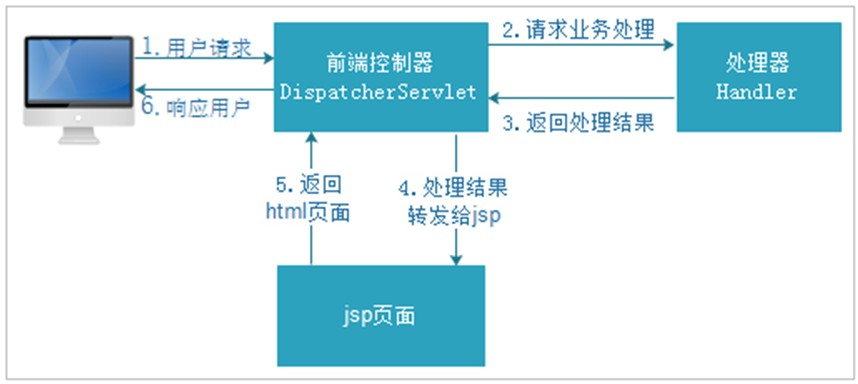
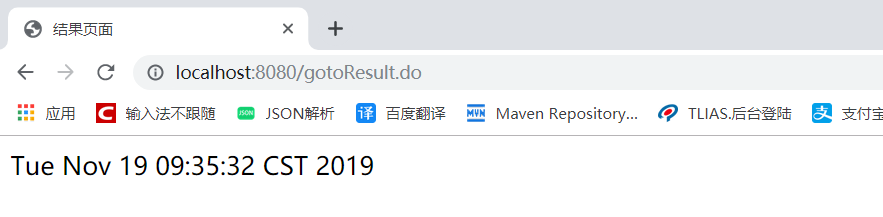
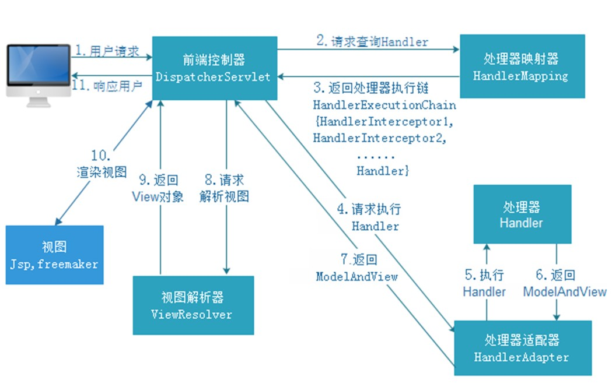
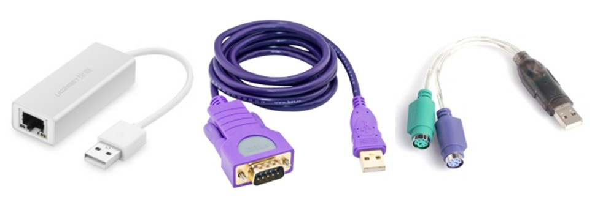

# SpringMVC

## 经典三层和MVC模式回顾

  软件的整体架构有B/S（浏览器/服务器模式）和C/S（客户端/服务器模式），ee开发主要就是B/S模式,从代码开发的角度，代码有层的概念.

  经典三层：web表现层（view+controller）+service业务层+dao（数据接入访问层）


## 经典三层

- 表现层（Web层）

  **整个表现层负责接收客户端浏览器的请求并响应结果给客户端浏览器显示。**（Http请求）

  具体说来，表现层=View视图层+Controller控制层。Controller层负责接收请求、转发请求给Service层、跳转视图页面,servlet-->Struts(过滤器)-->SpringMVC

- 业务层（Service层）

  负责业务逻辑处理，和项目需求息息相关（比如转账业务）。

- Spring-->SpringBoot(全注解)

- 主要涉及逻辑 : 异常处理参数处理声明式事务AOP

- 持久层（Dao层）

  和数据库交互，对数据表进行增删改查

  JDBC--> JdbcTemplate --> DButils -->MyBatis-->Spring Data JPA -->MyBatis Plus

 主流：SSM -->潮流：Spring全家桶


## SpringMVC框架概述  

  SpringMVC是一个轻量级的Web表现层框架，用来写Controller接收请求跳转页面的，它是Spring框架的一部分。SpringMVC是对Servlet的封装和增强，简化了servlet的操作。它已经超越了Struts，成为目前最优秀的表现层框架。

- 学习SpringMVC，要把握它的本质
  - 接收请求，转发请求
  - 跳转页面
- 什么时候使用SpringMVC？
  - 当你觉得servlet繁琐的时候

- 在哪儿使用SpringMVC？
  - 在web表现层使用SpringMVC

- SpringMVC的优势
  - 操作特简单，性能特别高，灵活性特别强

- 与Struts框架相比
  - 解决了struts的安全性低,操作难,执行性能低的问题

- 拓展认识
  - Spring + Spring jdbctemplate + SpringMVC --> Spring全家桶 1.0 主流
  - Spring cloud + Spring Boot + Spring Data JPA + SpringMVC --> Spring全家桶2.0潮流


## SpringMVC的处理流程

  之前：request请求到servlet，一个项目中有很多servlet，不同serlvet处理不同的事情，好比很多年前装修，业主需要直接把需求告知水工、电工、木工等。现在我们直接把需求告知包工头，包工头具体分发任务给下面的小弟（水工、电工、木工），我们不需要直接和其他人交涉。

  前端控制器就类似于上面的包工头，不干具体的活，只负责接收请求，分发请求，反馈结果。

  SpringMVC全局只需要一个servlet。




## SpringMVC快速入门

### 需求：

  浏览器输入url发起请求，该url请求被SpringMVC框架拦截处理，把后台服务器的当前时间输出到jsp页面显示。

### 实现步骤：

- 创建Maven工程，引入spring框架jar包，springMVC框架jar包，Servlet与jsp jar包
- 定义类DefaultController
- 方法gotoResult()，参数和返回值类型为ModelAndView
- 类添加@Controller注解
- 方法添加@RequestMapping注解，注解属性为客户端访问虚拟路径
- spring配置文件中，配置注解扫描
- web.xml配置mvc框架前端控制器

##### pom.xml配置

```xml
<?xml version="1.0" encoding="UTF-8"?>
<project xmlns="http://maven.apache.org/POM/4.0.0"
         xmlns:xsi="http://www.w3.org/2001/XMLSchema-instance"
         xsi:schemaLocation="http://maven.apache.org/POM/4.0.0 http://maven.apache.org/xsd/maven-4.0.0.xsd">
    <modelVersion>4.0.0</modelVersion>

    <groupId>com.itheima</groupId>
    <artifactId>SpringMVC_day01_01_helloworld</artifactId>
    <version>1.0-SNAPSHOT</version>
    <packaging>war</packaging>

    <properties>
        <maven.compiler.source>1.8</maven.compiler.source>    
        <maven.compiler.target>1.8</maven.compiler.target>    
        <maven.compiler.compilerVersion>1.8</maven.compiler.compilerVersion>    
    </properties>

    <dependencies>
        <dependency>
            <groupId>org.springframework</groupId>
            <artifactId>spring-context</artifactId>
            <version>5.1.9.RELEASE</version>
        </dependency>
        <dependency>
            <groupId>org.springframework</groupId>
            <artifactId>spring-webmvc</artifactId>
            <version>5.1.9.RELEASE</version>
        </dependency>
        <dependency>
            <groupId>javax.servlet</groupId>
            <artifactId>servlet-api</artifactId>
            <version>2.5</version>
            <scope>provided</scope>
        </dependency>
        <dependency>
            <groupId>javax.servlet.jsp</groupId>
            <artifactId>jsp-api</artifactId>
            <version>2.2</version>
        </dependency>
    </dependencies>

    <build>
        <plugins>
            <!--Tomcat7服务端的插件-->
            <plugin>
                <groupId>org.apache.tomcat.maven</groupId>
                <artifactId>tomcat7-maven-plugin</artifactId>
            </plugin>
        </plugins>
    </build>
</project>
```

##### DefaultController类

```java
/**
 * 控制器( 理解为 相当与WEB阶段的 Servlet)
 */
@Controller
public class DefaultController {

    /**
     * 定义方法, 相当于以前 Servlet 中 用于处理请求的方法
     */
    @RequestMapping("gotoResult")
    public ModelAndView gotoResult(ModelAndView modelAndView){
        //封装数据
        modelAndView.addObject("nowDate", new Date());
        //指定页面
        modelAndView.setViewName("WEB-INF/jsp/result.jsp");

        return modelAndView;
    }
}
```

##### Result.jsp

```jsp
<%@ page contentType="text/html;charset=UTF-8" language="java" %>
<html>
<head>
    <title>结果页面</title>
</head>
<body>
    ${nowDate}
</body>
</html>
```

##### springvmc.xml配置

```xml
<?xml version="1.0" encoding="UTF-8"?>
<beans xmlns="http://www.springframework.org/schema/beans"
       xmlns:xsi="http://www.w3.org/2001/XMLSchema-instance"
       xmlns:context="http://www.springframework.org/schema/context"
       xsi:schemaLocation="http://www.springframework.org/schema/beans
       http://www.springframework.org/schema/beans/spring-beans.xsd http://www.springframework.org/schema/context http://www.springframework.org/schema/context/spring-context.xsd">

    <!--开启SpringIOC 注解扫描-->
    <context:component-scan base-package="com.itheima.controller"></context:component-scan>

</beans>
```

##### web.xml配置

```xml
<?xml version="1.0" encoding="UTF-8"?>
<web-app xmlns="http://xmlns.jcp.org/xml/ns/javaee"
         xmlns:xsi="http://www.w3.org/2001/XMLSchema-instance"
         xsi:schemaLocation="http://xmlns.jcp.org/xml/ns/javaee http://xmlns.jcp.org/xml/ns/javaee/web-app_3_1.xsd"
         version="3.1">
    
    <!--配置SpringMVC的前端控制器-->
    <servlet>
        <servlet-name>dispatcherServlet</servlet-name>
        <servlet-class>org.springframework.web.servlet.DispatcherServlet</servlet-class>
        <!--加载SpringMVC的核心配置-->
        <init-param>
            <param-name>contextConfigLocation</param-name>
            <param-value>classpath:springmvc.xml</param-value>
        </init-param>
        <!--随着Tomcat服务器的启动加载当前web项目时, 完成SpringMVC的前端控制器Servlet的创建, 实现了SpringMVC配置的初始化加载-->
        <load-on-startup>1</load-on-startup>
    </servlet>
    <servlet-mapping>
        <servlet-name>dispatcherServlet</servlet-name>
        <url-pattern>*.do</url-pattern>
    </servlet-mapping>
</web-app>
```

浏览器访问:

 


## SpringMVC架构



### 组件说明

- DispatcherServlet：前端控制器

  接收用户请求，响应结果，相当于中央处理器，DispatcherServlet是整个流程控制的中心，由它调用其它组件完成用户请求的处理。DispatcherServlet的存在降低了组件之间的耦合性。

- HandlerMapping：处理器映射器

  理解为一个Map<url,Hanlder>，HandlerMapping负责根据用户请求的Url找到Handler即处理器，SpringMVC提供了不同的映射器来实现不同的映射方式，例如：实现接口方式，注解方式等。

- Handler：处理器

  在SpringMVC当中有两层意思：Controller或者Controller当中的方法，Handler相对于前端控制器DispatcherServlet来说是后端控制器，执行具体业务处理的，它在DispatcherServlet的控制下处理用户的具体请求。

- HandlAdapter：处理器适配器

  不同的接口类型转换成usb，体现了万物归一的思想，通过HandlerAdapter对Handler处理器进行执行，这是适配器模式的应用。

  

- ViewResolver：视图解析器

  ViewResolver进行视图解析，首先根据逻辑视图名解析成物理视图名即具体的页面地址，再生成View视图对象。 

  - 视图解析器的配置

```xml
<!--配置视图解析器-->
<bean id="viewResolver" 
      class="org.springframework.web.servlet.view.InternalResourceViewResolver">
    <property name="prefix" value="/WEB-INF/jsp/"></property>
    <property name="suffix" value=".jsp"></property>
</bean>
```

- View：视图

  SpringMVC框架提供了很多的View视图类型的支持，包括：jsp、freemarkerView等。我们最常用的视图就是jsp

- 注意：在SpringMVC的各个组件中，处理器映射器、处理器适配器、视图解析器称为SpringMVC的三大组件。需要我们开发的组件有handler、view

### 架构流程

- 第一步：用户发送请求至前端控制器DispatcherServlet
- 第二步：DispatcherServlet收到请求调用HandlerMapping处理器映射器
- 第三步：处理器映射器根据请求Url找到,具体的Handler（后端控制器），生成处理器对象及处理器拦截器(如果有则生成)一并返回DispatcherServlet
- 第四步：DispatcherServlet调用HandlerAdapter处理器适配器去调用Handler
- 第五步：处理器适配器执行Handler
- 第六步：Handler执行完成给处理器适配器返回ModelAndView
- 第七步：处理器适配器向前端控制器返回 ModelAndView，ModelAndView 是SpringMVC 框架的一个底层对象，包括 Model 和 View
- 第八步：前端控制器请求视图解析器去进行视图解析，根据逻辑视图名来解析真正的视图。
- 第九步：视图解析器向前端控制器返回View
- 第十步：前端控制器进行视图渲染，就是将模型数据（在 ModelAndView 对象中）填充到 request 域
- 第十一步：前端控制器向用户响应结果

### 配置mvc: annotation-driven

  处理器映射器、处理器适配器我们在入门程序没有配置，也可以用，因为SprigMVC默认会给我们加载处理器(处理器映射器、处理器适配器)，但是默认加载的处理器(处理器映射器、处理器适配器)版本为Spring3.x, 现在已经不推荐使用了，推荐使用更好的。

使用很简单, 配置一个标签即可，SpringMVC会自动注册最合适的处理器映射器、处理器适配器。

```xml
<!--配置SpringMVC注解驱动-->
<mvc:annotation-driven></mvc:annotation-driven>
```

## @RequestMapping注解使用

##### 用法1: 多个URL路径映射到同一个Handler（同一个方法）

* index.jsp页面

```html
<fieldset>
    <h4>用法1: 多个URL路径映射到同一个Handler（同一个方法）</h4>
    <a href="http://localhost:8080/gotoResultURL1.do">测试路径1</a>
    <a href="${pageContext.request.contextPath}/gotoResultURL2.do">测试路径2</a>
</fieldset>
```

* DefaultController控制器

```java
public class DefaultController {

    //用法1: 多个URL路径映射到同一个Handler（同一个方法）
    @RequestMapping(value={"gotoResultURL1","gotoResultURL2"})
    public ModelAndView gotoResultURL(ModelAndView modelAndView){
        //封装数据
        modelAndView.addObject("nowDate", new Date() +"====Default===gotoResultURL");
        //指定页面
        modelAndView.setViewName("result");

        return modelAndView;
    }
}
```


##### 用法2:RequestMapping注解作用在类上，实现对请求路径的分类管理，限定类中方法访问的前缀

* index.jsp页面

```html
<fieldset>
    <h4>用法2:RequestMapping注解作用在类上，实现对请求路径的分类管理，限定类中方法访问的前缀</h4>
    <a href="http://localhost:8080/default/gotoResultURL1.do">测试Default路径</a>
    <a href="${pageContext.request.contextPath}/user/gotoResultURL1.do">测试User路径</a>
</fieldset>
```

* DefaultController控制器

```java
@Controller
//用法2:RequestMapping注解作用在类上，实现对请求路径的分类管理，限定类中方法访问的前缀
    @RequestMapping("default")
    public class DefaultController {

        //用法1: 多个URL路径映射到同一个Handler（同一个方法）
        @RequestMapping(value={"gotoResultURL1","gotoResultURL2"})
        public ModelAndView gotoResultURL(ModelAndView modelAndView){
            //封装数据
            modelAndView.addObject("nowDate", new Date() +"====Default===gotoResultURL");
            //指定页面
            modelAndView.setViewName("result");

            return modelAndView;
        }
    }
}
```

* UserController控制器

```java
@Controller
@RequestMapping("user")
public class UserController {

    //用法1: 多个URL路径映射到同一个Handler（同一个方法）
    @RequestMapping(value={"gotoResultURL1","gotoResultURL2"})
    public ModelAndView gotoResultURL(ModelAndView modelAndView){
        //封装数据
        modelAndView.addObject("nowDate", new Date() +"===User===gotoResultURL");
        //指定页面
        modelAndView.setViewName("result");

        return modelAndView;
    }
}
```


##### 用法3 method属性限定请求方法: 请求的handler相同，请求方式不同进入不同方法处理

method属性限定请求方法，请求的handler相同，请求方式不同进入不同方法处理，访问的url是一样的（Handler名字是一样的），但是我根据你不同的请求方式（get/post）进入不同的方法处理，请求的url一样，但是请求方式不一样（get/post）

* index.jsp

```html
<fieldset>
    <h4>用法3 method属性限定请求方法: 请求的handler相同，请求方式不同进入不同方法处理</h4>
    <a href="http://localhost:8080/default/gotoResultMethod.do">Get方式测试</a>
    <form action="http://localhost:8080/default/gotoResultMethod.do" method="post">
        <input type="submit" value="Post方式测试">
    </form>
</fieldset>
```

* DefaultController控制器

```java
    /**
     * url相同，但是请求方式为GET
     * @RequestMapping注解属性method
     */
    @RequestMapping(value = "gotoResultMethod",method = RequestMethod.GET)
    public ModelAndView gotoResultMethodGet(ModelAndView modelAndView){
        modelAndView.addObject("nowDate",new Date()+"Method=GET");
        modelAndView.setViewName("index");
        return modelAndView;
    }

    /**
     * url相同，但是请求方式为POST
     * @RequestMapping注解属性method
     */
    @RequestMapping(value = "gotoResultMethod",method = RequestMethod.POST)
    public ModelAndView gotoResultMethodPost(ModelAndView modelAndView){
        modelAndView.addObject("nowDate",new Date()+"Method=POST");
        modelAndView.setViewName("index");
        return modelAndView;
    }
```


##### 用法4 params属性限定请求参数 : 支持简单的表达式语法，url一样，根据携带参数的不同进入不同的方法处理

params属性限定请求参数，支持简单的表达式语法，url一样，根据携带参数的不同进入不同的方法处理，url相同，请求方式相同，请求参数不同进入不同hanlder方法处理

* index.jsp页面

```html
<fieldset>
    <h4>用法4 params属性限定请求参数 : 支持简单的表达式语法，url一样，根据携带参数的不同进入不同的方法处理</h4>
    <a href="http://localhost:8080/user/login.do?type=user">普通用户</a>
    <a href="http://localhost:8080/user/login.do?type=admin">管理员</a>
    <a href="http://localhost:8080/user/login.do?type=vip">VIP</a>
</fieldset>
```

* UserController控制器

```java
@Controller
@RequestMapping("user")
public class UserController {

    //用法1: 多个URL路径映射到同一个Handler（同一个方法）
    @RequestMapping(value={"gotoResultURL1","gotoResultURL2"})
    public ModelAndView gotoResultURL(ModelAndView modelAndView){
        //封装数据
        modelAndView.addObject("nowDate", new Date() +"===User===gotoResultURL");
        //指定页面
        modelAndView.setViewName("result");

        return modelAndView;
    }

    //普通用户
    @RequestMapping(value={"login"}, params = {"type=user"})
    public ModelAndView loginUser(ModelAndView modelAndView){
        //封装数据
        modelAndView.addObject("nowDate", new Date() +"===user");
        //指定页面
        modelAndView.setViewName("result");

        return modelAndView;
    }
    //管理员
    @RequestMapping(value={"login"}, params = {"type=admin"})
    public ModelAndView loginAdmin(ModelAndView modelAndView){
        //封装数据
        modelAndView.addObject("nowDate", new Date() +"===admin");
        //指定页面
        modelAndView.setViewName("result");

        return modelAndView;
    }
    //VIP
    @RequestMapping(value={"login"}, params = {"type=vip"})
    public ModelAndView loginVIP(ModelAndView modelAndView){
        //封装数据
        modelAndView.addObject("nowDate", new Date() +"===VIP");
        //指定页面
        modelAndView.setViewName("result");

        return modelAndView;
    }

    /*
     * url相同，请求方式相同，请求参数不同
     * @RequestMapping注解属性params
     * id：表示请求必须包含名为 id 的请求参数
     *        演示: http://localhost:8080/user/gotoResultParamsURL.do?id=11
     * !id：表示请求不能包含名为 id 的请求参数
     *        演示: http://localhost:8080/user/gotoResultParamsURL?id=123
     * id!=100：表示请求包含名为 param1 的请求参数，但其值不能为 100
     *       演示: http://localhost:8080/user/gotoResultParamsURL.do?id=100
     *{“id!=100”, “name”}：请求必须包含名为 id 和 name 的两个请求参数，
     *      http://localhost:8080/user/gotoResultParamsURL.do?id=123
     */
    @RequestMapping(value={"gotoResultParamsURL"}, params = {"id!=100","name"})
    public ModelAndView gotoResultParamsURL (ModelAndView modelAndView){
        //封装数据
        modelAndView.addObject("nowDate", new Date() +"===gotoResultParamsURL");
        //指定页面
        modelAndView.setViewName("result");

        return modelAndView;
    }
}
```


## 请求参数绑定

### 功能1 : 默认支持ServletAPI

- SpringMVC在方法中直接声明HttpServletRequest，HttpServletResponse，HttpSession即可使用

代码演示:

* index.jsp页面

```jsp
<fieldset>
    <h4>功能1: 默认支持ServletAPI</h4>
    <a href="${pageContext.request.contextPath}/params/gotoParams.do?id=123&name=lisi">测试</a>
</fieldset>
```

* ParamsController控制器中的方法

```java
//功能1: 默认支持ServletAPI
@RequestMapping("gotoParams")
public ModelAndView gotoParams(HttpServletRequest request, HttpServletResponse response, HttpSession session, ModelAndView modelAndView){
    //获取请求参数
    String id = request.getParameter("id");
    String name = request.getParameter("name");

    //封装数据
    modelAndView.addObject("nowDate", new Date()+"===="+id+"==="+name);
    //指定页面
    modelAndView.setViewName("result");
    return modelAndView;
}
```


### 功能2: 绑定简单数据类型

- 基本数据类型推荐使用包装类，包装类可以为null
- 说明：对于布尔类型的参数，请求的参数值为true或false。或者1或0

代码演示:

- index.jsp页面

```jsp
<fieldset>
    <h4>功能2: 绑定简单的数据类型</h4>
    <a href="${pageContext.request.contextPath}/params/gotoParamsBase.do?isVIP=0">测试</a>
</fieldset>
```

- ParamsController控制器中的方法

```java
  /**
     *  绑定基本数据类型参数
     *  参数的名字，和请求参数的键相同
     */
    //功能2: 绑定简单数据类型
    @RequestMapping({"gotoParamsBase"})
    public ModelAndView gotoParamsBase(Boolean isVip, ModelAndView modelAndView){
        modelAndView.addObject("nowDate", new Date()+"===="+ isVip);
        modelAndView.setViewName("Result");
        return modelAndView;
    }

    /*
    //功能2: 绑定简单数据类型
    @RequestMapping({"gotoParamsBase"})
    public ModelAndView gotoParamsBase(Integer id, ModelAndView modelAndView){
        modelAndView.addObject("nowDate", new Date()+"===="+ id);
        modelAndView.setViewName("Result");
        return modelAndView;
    }
```


### 功能3: @RequestParam注解使用

##### 当形参和传递的参数名称不一致时使用RequestParam进行手动映射

- 当形参和传递的参数名称不一致时使用RequestParam进行手动映射，类似于Mybatis中resultMap的作用

代码演示:

- index.jsp页面

```jsp
<fieldset>
    <h4>功能3: @RequsestParam注解的使用</h4>
    <a href="${pageContext.request.contextPath}/params/gotoParamsRequestParam.do?id=1001">测试</a>
</fieldset>
```

- ParamsController控制器中的方法

```java
//功能3: @RequsestParam注解的使用
@RequestMapping("gotoParamsRequestParam")
public ModelAndView gotoParamsRequestParam(@RequestParam("id") Integer ids, ModelAndView modelAndView){
    //封装数据
    modelAndView.addObject("nowDate", new Date()+"===="+ids);
    //指定页面
    modelAndView.setViewName("result");
    return modelAndView;
}
```


### 功能4: 绑定pojo对象

- 直接形参声明pojo即可接收
- 要求：传递的参数名必须和pojo属性名对应

代码演示:

- index.jsp页面

```jsp
<fieldset>
    <h4>功能4: 绑定pojo对象</h4>
    <a href="${pageContext.request.contextPath}/params/gotoParamsPojo.do?id=2&name=lisi">测试</a>
</fieldset>
```

- ParamsController控制器中的方法

```java
//功能4: 绑定pojo对象
//请求参数的键名和pojo对象属性名一致即可
@RequestMapping("gotoParamsPojo")
public ModelAndView gotoParamsPojo(User user, ModelAndView modelAndView){
    //封装数据
    modelAndView.addObject("nowDate", new Date()+"===="+user);
    //指定页面
    modelAndView.setViewName("result");
    return modelAndView;
}
```


### 功能5: 绑定pojo对象的包装对象

- 重点在于传参参数的命名
- pojo包装对象首先就是一个普通的pojo，就应该按照上面绑定pojo的要求来，然后进一步处理，传参时参数名，首先应该定位到包装对象的属性名，如果不能确定数据，通过属性.的方式进一步锁定即可

代码演示:

- index.jsp页面

```jsp
<fieldset>
    <h4>功能5: 绑定pojo对象的包装对象</h4>
    <a href="${pageContext.request.contextPath}/params/gotoParamsQueryVo.do?user.id=2&user.name=zhang3">测试</a>
</fieldset>
```

- ParamsController控制器中的方法

```java
//功能5: 绑定pojo对象的包装对象
@RequestMapping("gotoParamsQueryVo")
public ModelAndView gotoParamsQueryVo(QueryVo queryVo, ModelAndView modelAndView){
    //封装数据
    modelAndView.addObject("nowDate", new Date()+"===="+queryVo);
    //指定页面
    modelAndView.setViewName("result");
    return modelAndView;
}
```


### 功能6: 绑定List集合包装pojo对象

- 传递绑定集合类型(List/Map)，作为POJO的一个属性来传递

代码演示:

- index.jsp页面

```jsp
<fieldset>
    <h4>功能6: 绑定List集合包装pojo对象</h4>
    <form action="${pageContext.request.contextPath}/params/gotoParamsList.do" method="get">
        <table>
            <tr>
                <th>id</th>
                <th>name</th>
                <th>sex</th>
            </tr>
            <tr>
                <td><input type="text" name="userList[0].id" placeholder="请输入ID"></td>
                <td><input type="text" name="userList[0].name" placeholder="请输入用户名"></td>
                <td><input type="text" name="userList[0].sex" placeholder="请输入性别"></td>
            </tr>
            <tr>
                <td><input type="text" name="userList[1].id" placeholder="请输入ID"></td>
                <td><input type="text" name="userList[1].name" placeholder="请输入用户名"></td>
                <td><input type="text" name="userList[1].sex" placeholder="请输入性别"></td>
            </tr>
        </table>


        <input type="submit" value="提交">
    </form>
</fieldset>
```

- ParamsController控制器中的方法

```java
//功能6: 绑定List集合包装pojo对象
@RequestMapping("gotoParamsList")
public ModelAndView gotoParamsList(QueryVo queryVo, ModelAndView modelAndView){
    //封装数据
    modelAndView.addObject("nowDate", new Date()+"===="+queryVo);
    //指定页面
    modelAndView.setViewName("result");
    return modelAndView;
}
```


### 功能7: 绑定Map集合包装pojo对象

代码演示:

* index.jsp 页面

```jsp
<fieldset>
    <h4>功能7: 绑定Map集合包装pojo对象</h4>
    <form action="${pageContext.request.contextPath}/params/gotoParamsMap.do" method="get">
        <table>
            <tr>
                <th>id</th>
                <th>name</th>
                <th>sex</th>
            </tr>
            <tr>
                <td><input type="text" name="userMap['user001'].id" placeholder="请输入ID"></td>
                <td><input type="text" name="userMap['user001'].name" placeholder="请输入用户名"></td>
                <td><input type="text" name="userMap['user001'].sex" placeholder="请输入性别"></td>
            </tr>
            <tr>
                <td><input type="text" name="userMap['user002'].id" placeholder="请输入ID"></td>
                <td><input type="text" name="userMap['user002'].name" placeholder="请输入用户名"></td>
                <td><input type="text" name="userMap['user002'].sex" placeholder="请输入性别"></td>
            </tr>
        </table>


        <input type="submit" value="提交">
    </form>
</fieldset>
```

* ParamsController控制器中的方法

```java
//功能7: 绑定Map集合包装pojo对象
@RequestMapping("gotoParamsMap")
public ModelAndView gotoParamsMap(QueryVo queryVo, ModelAndView modelAndView){
    //封装数据
    modelAndView.addObject("nowDate", new Date()+"===="+queryVo);
    //指定页面
    modelAndView.setViewName("result");
    return modelAndView;
}
```


## SpringMVC编码过滤器

```xml
 <!--配置编码过滤器: 过滤post请求-->
  <filter>
    <filter-name>CharacterEncodingFilter</filter-name>
    <filter-class>org.springframework.web.filter.CharacterEncodingFilter</filter-class>
    <!--初始化参数： 编码格式-->
    <init-param>
      <param-name>encoding</param-name>
      <param-value>utf-8</param-value>
    </init-param>
  </filter>
  <filter-mapping>
    <filter-name>CharacterEncodingFilter</filter-name>
    <url-pattern>/*</url-pattern>
  </filter-mapping>
```


## 自定义类型转换器

- 自定义类型转换器，实现接口Converter<S,T>
- 泛型S，转换之前的数据类型
- 泛型T，转换之后的数据类型

```java
/**
 * 日期转换器  String --> Date
 * - 泛型S，转换之前的数据类型
 * - 泛型T，转换之后的数据类型
 */
public class DateConverter implements Converter<String, Date> {
    @Override
    public Date convert(String s) {
        SimpleDateFormat sdf = new SimpleDateFormat("yyyy-MM-dd");
        Date date = null;
        try {
            date = sdf.parse(s);
        } catch (ParseException e) {
            e.printStackTrace();
        }
        return date;
    }
}
```

- 在springmvc的配置文件中,将自定义类型转换器，交给Spring容器管理

```xml
<!--配置处理器映射器、处理器适配器-->
<mvc:annotation-driven conversion-service="MyConversionService"></mvc:annotation-driven>

<!--配置格式化转换工厂对象-->
<bean id="MyConversionService" class="org.springframework.format.support.FormattingConversionServiceFactoryBean">
    <property name="converters">
        <set>
            <bean id="dateConverter" class="com.itheima.utils.DateConverter"></bean>
        </set>
    </property>
</bean>
```

index.jsp页面

 ```jsp
<fieldset>
    <p>08: 获取请求参数，字符串转成日期对象</p>
    <a href="${pageContext.request.contextPath}/params/sendParamsDate.do?date=2019-11-19">字符串转成日期对象</a><br>
</fieldset>
 ```

ParamsController控制器中的方法

```java
//功能8 : 字符串转成日期对象
@RequestMapping("sendParamsDate")
public ModelAndView sendParamsDate(Date date, ModelAndView modelAndView){
    //封装数据
    modelAndView.addObject("nowDate", date+"====gotoParamsDate");
    //指定页面
    modelAndView.setViewName("result");
    return modelAndView;
}
```


## @RequestHeader注解

- 获取请求头信息
- 属性value,属性值为请求头的键名

```java
    /**
     * 接收请求参数，获取请求头信息
     * @RequestHeader注解
     * 注解作用在方法参数上
     * 注解属性value配置请求头的键
     */
    //功能9 : 获取请求头的指定信息
    @RequestMapping("sendParamsHeader")
    public ModelAndView sendParamsHeader(@RequestHeader("User-Agent") String header, ModelAndView modelAndView){
        //封装数据
        modelAndView.addObject("nowDate", new Date()+"===="+header);
        //指定页面
        modelAndView.setViewName("result");
        return modelAndView;
    }
```

```jsp
<fieldset>
    <h4>09: 获取请求头参数，@RequestHeader注解</h4>
    <a href="${pageContext.request.contextPath}/params/sendParamsHeader.do">获取请求头参数</a><br>
</fieldset>
```

## @CookieValue注解

- 获取浏览器携带的Cookie
- 属性value,属性值是Cookie的键名

```java
/**
     * 接收请求参数，获取Cookie中的sessionID
     * @CookieValue注解
     * 注解用于方法参数上
     * 注解属性value,配置Cookie的键
     */
    //功能10 : 获取指定Cookie的value值
    @RequestMapping("sendParamsCookie")
    public ModelAndView sendParamsCookie(@CookieValue("JSESSIONID") String cookie, ModelAndView modelAndView){
        //封装数据
        modelAndView.addObject("nowDate", new Date()+"===="+cookie);
        //指定页面
        modelAndView.setViewName("result");
        return modelAndView;
    }
```

```jsp
<fieldset>
    <h4>10: 获取指定的Cookie的value值，@CookieValue注解</h4>
    <a href="${pageContext.request.contextPath}/params/sendParamsCookie.do">获取指定的Cookie的value值</a><br>
</fieldset>
```

