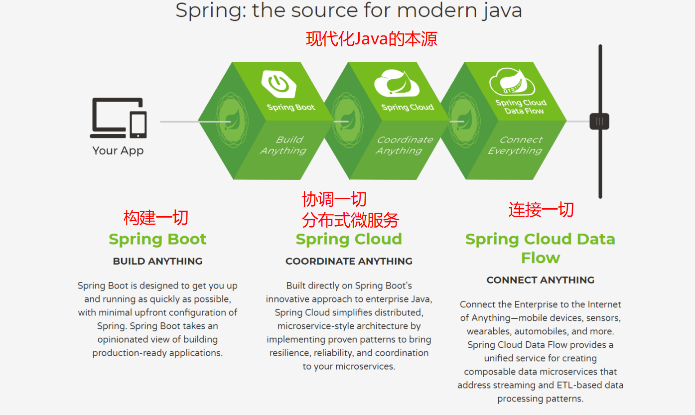
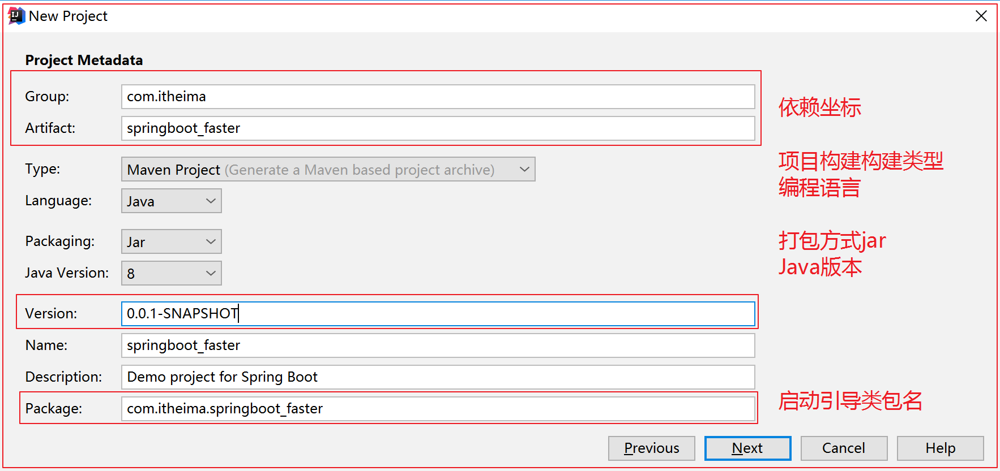
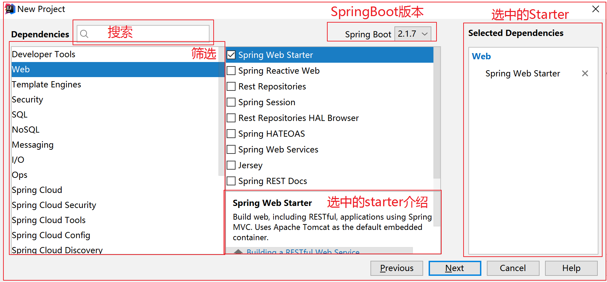
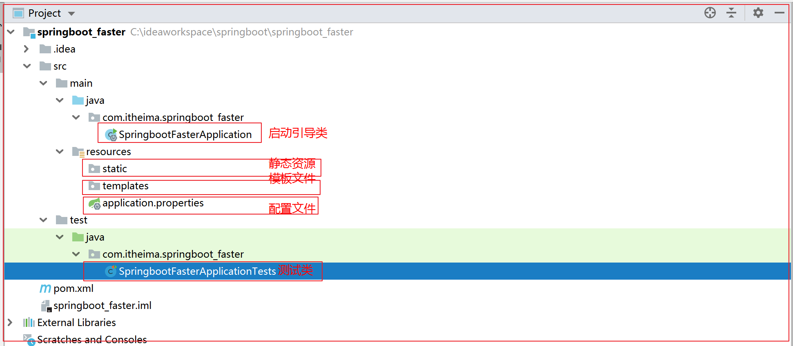
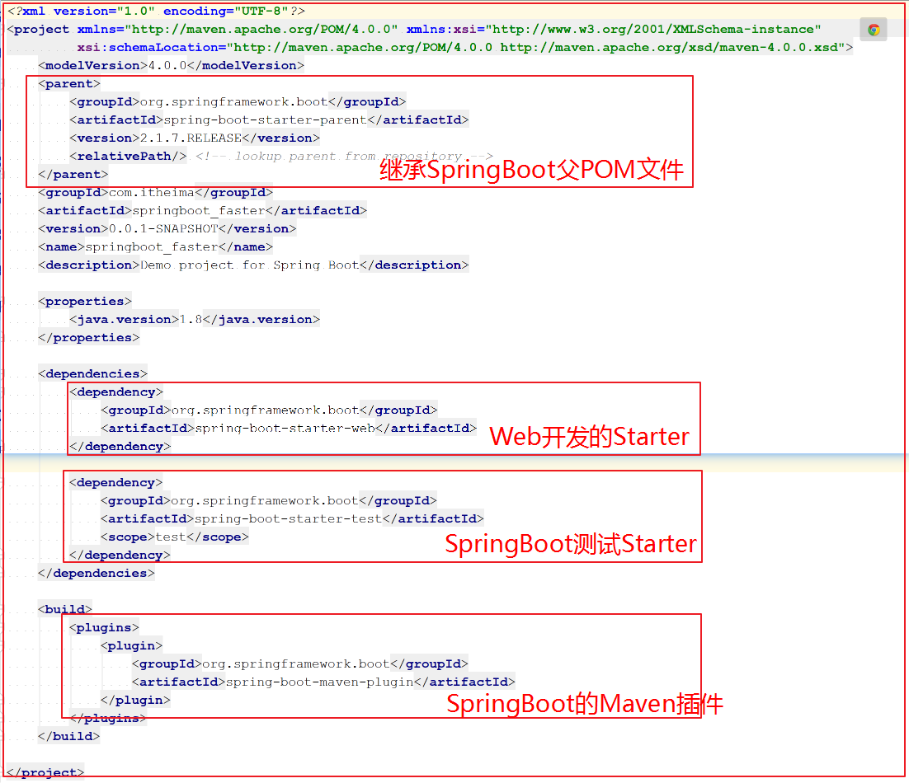
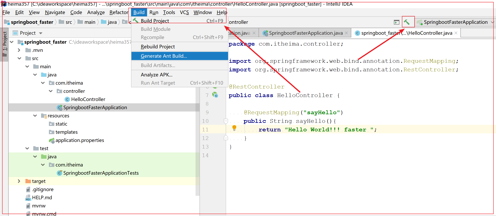
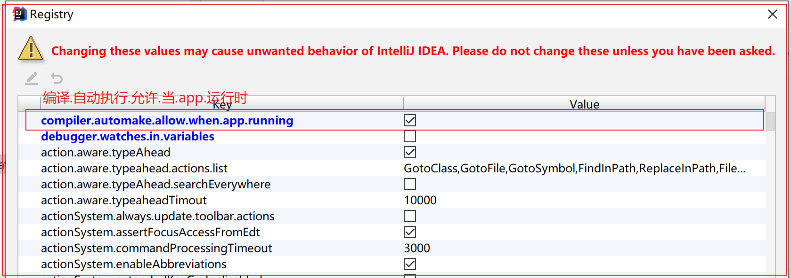
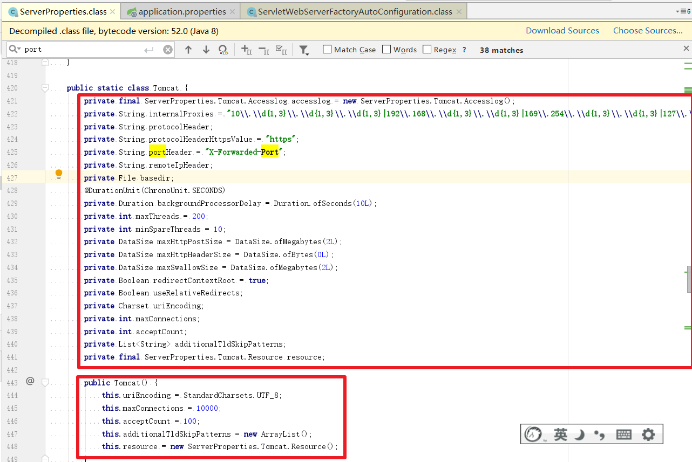
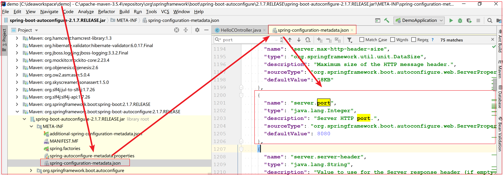

# 今日授课目标

1. 能够理解SpringBoot的设计初衷，开发环境要求
2. 能够搭建SpringBoot的开发工程
3. 能够理解SpringBoot的配置文件常见配置ApplactionContext.xml
   - 导包
   - 配置文件
   - api(new对象)
4. 能够使用SpringBoot整合MyBatis，整合Redis进行缓存，整合RestTemplate发送Http请求
5. 能够使用SpringBoot进行简单代码测试
6. 能够打包部署SpringBoot项目

> 学习今日内容，必备基础知识：
>
> 1. Spring的对象ioc容器：new ClassPathXMLApplicationContext()、@Value、@Configuration
>
> 2. SpringMVC：@RestController、@RequestMapping
>
> 3. Maven知识：依赖传递、依赖管理(BOM,Bill of Material)<dependencyManagement>、依赖冲突、依赖排除、打包
>
> 4. Mybatis：@Select注解
>
> 5. 定时器：cron表达式

# 一、SpringBoot简介

当前互联网后端开发中，JavaEE占据了主导地位。对JavaEE开发，首选框架是Spring框架。在传统的Spring开发中，需要使用大量的与业务无关的XML配置才能使Spring框架运行起来，这点备受许多开发者诟病。随着Spring4.x发布，Spring已经完全脱离XML，只使用注解就可以运行项目。为了进一步简化Spring应用的开发，SpringBoot诞生了。它是由Pivotal团队提供的全新框架，其设计目的是简化Spring应用的搭建及开发过程，并迎合时下流行的分布式微服务设计思想，越来越多企业在使用SpringBoot。本课程跟随时代的潮流，带大家张掌握这门技术。

## 1.1 设计初衷

- 为Spring开发者提供一种，更快速、体验更好的Spring应用开发方式。
- 开箱即用，同时也可快速扩展
- 嵌入式的Tomcat。
- 绝对没有冗余代码，无需XML配置。

## 1.2 核心功能

- 核心能力：Spring容器、日志、自动配置AutoCongfiguration、Starters
- web应用的能力：MVC、嵌入式Web服务器
- 数据访问(持久化)：关系型数据库、非关系型数据库
- 强大的整合其他技术的能力
- 测试：强悍的应用测试



## 1.3 开发环境要求

Spring Boot 的2.2.2.RELEASES正式发行版，使用Java8、Java 11或Java 13，对应的Spring版本是5.2.0。构建工具Maven版本要求是3.3及以上，最好是使用Maven的3.5.4版本。

**Servlet容器版本：**

SpringBoot 支持如下的嵌入式Servlet容器，Spring Boot应用程序最低支持到Servlet 3.1的容器。

| Name         | Servlet Version |
| ------------ | --------------- |
| Tomcat 9.0   | 4.0             |
| Jetty 9.4    | 3.1             |
| Undertow 2.0 | 4.0             |

## 1.4 Spring怎么做Web开发？

我们怎么开发一个web项目：

1. web.xml配置：SpringMVC核心控制器(DispatchServlet)，Spring容器监听器，编码过滤器....
2. Spring 配置：包扫描(service、dao)，配置数据源，配置事务....
3. SpringMVC配置：包扫描(controller)，视图解析器，注解驱动，拦截器，静态资源....
4. 日志配置
5. 少量业务代码
6. …
7. 部署 Tomcat 调试，每次测试都需要部署
8. …

但是如果用 Spring Boot 呢？

超简单！无需配置！！无感Tomcat！超迅速搭建功能强大的整套 Web！到底多简单？入门案例揭晓。

# 二、SpringBoot快速入门

## 2.1 Maven搭建SpringBoot工程

Maven搭建SpringBoot工程，实现web的请求响应。浏览器访问在页面中输出`helloworld`。

- http://127.0.0.1:8080/sayHello
- Hi,my name is SpringBoot!!!

**实现步骤：**

1. 创建Maven工程
2. pom.xml文件中配置起步依赖
3. 编写SpringBoot启动引导类
4. 编写Controller
5. 访问http://localhost:8080/hello测试

**实现过程：**

1. 创建Maven工程day01_springboot_helloworld

2. pom.xml文件中配置父坐标和web的起步依赖

   ```xml
   <?xml version="1.0" encoding="UTF-8"?>
   <project xmlns="http://maven.apache.org/POM/4.0.0"
            xmlns:xsi="http://www.w3.org/2001/XMLSchema-instance"
            xsi:schemaLocation="http://maven.apache.org/POM/4.0.0 http://maven.apache.org/xsd/maven-4.0.0.xsd">
       <modelVersion>4.0.0</modelVersion>
       <!--继承SpringBoot父POM文件-->
       <parent>
           <groupId>org.springframework.boot</groupId>
           <artifactId>spring-boot-starter-parent</artifactId>
           <version>2.1.7.RELEASE</version>
       </parent>
   
       <groupId>com.itheima</groupId>
       <artifactId>day01_springboot_helloword</artifactId>
       <version>1.0-SNAPSHOT</version>
   
       <dependencies>
           <!--web 开发的相关依赖-->
           <dependency>
               <groupId>org.springframework.boot</groupId>
               <artifactId>spring-boot-starter-web</artifactId>
           </dependency>
       </dependencies>
   </project>
   ```
   
3. 编写SpringBoot引导类

   ```java
   @Configuration//配置类
   @EnableAutoConfiguration//开启自动配置
   @ComponentScan//包扫描
   public class DemoApplication {
       public static void main(String[] args) {
           SpringApplication.run(DemoApplication.class,args);
       }
   }
   ```

4. 编写三层架构代码：Controller

   1. controller

      ```java
      @RestController
      public class HelloController {
      
          @RequestMapping("/hello")
          public String hello(String name){
              return "hello world!!!";
          }
      }
      
      ```
   
5. 访问http://localhost:8080/hello测试


## 2.2 使用IDEA快速创建SpringBoot项目

使用Spring Initializr 方式创建SpringBoot工程。然后实现入门案例的代码。

俗称：基础部分重复架构代码

**实现步骤：**

1. 使用Spring Initializr创建SpringBoot

2. 配置项目信息

3. 勾选起步依赖

4. 配置文件存储路径地址

5. 再次编写入门案例三层架构代码
6. 访问http://localhost:8080/hello接口测试

**实现过程：**

1. 使用创建SpringBoot工程
2. 配置项目信息
3. 勾选起步依赖
4. 配置文件存储路径地址
5. 创建完成后工程目录结构
   - pom文件介绍
6. 编写入门案例代码
7. 访问http://localhost:8080/hello接口测试

## 2.3 SpringBoot工程热部署

只需导入开发者工具依赖坐标，即可实现热部署功能：

```xml
<!--spring-boot开发工具jar包，支持热部署--> 
<dependency>
	<groupId>org.springframework.boot</groupId>
	<artifactId>spring-boot-devtools</artifactId>
</dependency>
```

但还需注意：加入坐标之后，如果想要代码立即生效，必须在修改代码之后进行代码构建。默认情况IDEA不会自动构建，需要手动构建。如图两处地方均可。



每次手动构建很麻烦？！！还有一种自动构建解决方案，但不建议使用。就是设置`Build Project Automatically`。同时打开Maintenance维护(打开快捷键`Shift + Ctrl + Alt + /`)，选择Registry(注册表)，设置运行时自动编译。



# 三、SpringBoot原理分析

## 3.1 starters的原理

**==starters是依赖关系的整理和封装==**。是一套依赖坐标的整合，可以让导入应用开发的依赖坐标更方便。

利用依赖传递的特性：帮你把依赖打包了，starter

搞框架：

- 导包 == starter
- 配置文件 == AutoConfiguration
- new对象

有了这些Starters，你获得Spring和其整合的所有技术的一站式服务。无需配置(自动配置)、无需复制粘贴依赖坐标，一个坐标即可完成所有入门级别操作。举例：Web开发，只需要导入`spring-boot-starter-web`。

```xml
<dependency>
    <groupId>org.springframework.boot</groupId>
    <artifactId>spring-boot-starter-web</artifactId>
</dependency>
```

每个Starter包含了当前功能下的许多必备依赖坐标，这些依赖坐标是项目开发，上线和运行必须的。同时这些依赖也支持依赖传递。举例：`spring-boot-starter-web`包含了所有web开发必须的依赖坐标

[常用的starters有哪些？](https://docs.spring.io/spring-boot/docs/2.1.6.RELEASE/reference/html/using-boot-build-systems.html#using-boot-starter)非常多，一下只列举部分：


starter为什么不需要写版本？

## 3.2 依赖管理的原理

> BOM（Bill of Materials）依赖清单，是由Maven提供的功能，<dependencyMangament>
>
> BOM内定义成套相互兼容的jar包版本集合
>
> 使用时依赖时，只需依赖该BOM文件，即可放心的使用清单内的依赖jar包，且无需版本号。
>
> BOM设计初衷：方便维护项目依赖版本升级。

依赖管理(Dependency Management)

1. 继承了`spring-boot-starter-parent`的好处和特点

   - 默认编译Java 1.8
   - 默认编码UTF-8 
   - 通过spring-boot-denpendencies的pom管理所有公共Starter依赖的版本
   - spring-boot-denpendencies通过Maven的一个<dependency management>特性来实现版本管理
   - 随用随取，不用继承父类所有的starter依赖。

2. POM文件中的Maven插件

   ```xml
   <！-- 作用：将一个SpringBoot的工程打包成为可执行的jar包 -->
   <build>
   	<plugins>
   		<plugin>
   			<groupId>org.springframework.boot</groupId>
   			<artifactId>spring-boot-maven-plugin</artifactId>
   		</plugin>
   	</plugins>
   </build>
   ```

   如果想使用父pom文件中的任何插件，无需配置即可使用

## 3.3 自动配置(AutoConfiguration)原理

所有我们要配置的项目Pivotal团队的开发人员，帮我们写好了，怎么实现的，主要是通过@Configuration实现

SpringBoot采用约定大于配置设计思想，将所有可能遇到的配置信息提前配置好，写在自动配置的jar包中。每个Starter基本都会有对应的自动配置。

SpringBoot帮我们将配置信息写好，存放在一个jar包中：spring-boot-autoconfigure-2.1.11.RELEASE.jar

jar包里，存放的都是配置类，让配置类生效的"规则类"

**==自动配置的值在哪里？==**


**==自动配置的值怎么才能生效？==**

查看启动类注解@SpringBootApplication

追踪步骤：

2. @EnableAutoConfiguration
3. @Import({AutoConfigurationImportSelector.class})
4. spring.factories
5. org.springframework.boot.autoconfigure.web.servlet.ServletWebServerFactoryAutoConfiguration
6. @EnableConfigurationProperties({ServerProperties.class})
7. private final ServerProperties.Tomcat tomcat = new ServerProperties.Tomcat();



**有了自动配置，那么基本全部采用默认配置。当然也可以更改默认配置，怎么改？**

官网的自动配置的地址： https://docs.spring.io/spring-boot/docs/2.1.6.RELEASE/reference/html/common-application-properties.html 

## 三个原理分析小节：

- Starter：是一套依赖关系的整理和封装
  - 让我们更加专注于业务开发，无需关心依赖导入，依赖冲突，及依赖的版本
  - 在pom文件导入starter既可使用对应的功能
- 依赖管理：依赖管理是对依赖坐标的抽取和复用，统一管理依赖坐标的版本。
  - 实现了依赖坐标的版本管理
  - starter随用随取
  - 避免了继承所有父类starter的依赖的臃肿
  - 避免了记忆所有starter的麻烦。
- 自动配置：预先写入配置类，封装到AutoConfiguration的jar包中，按需求加载配置信息。
  - 基于约定大于配置的设计思想
  - 极大的降低了Spring应用配置的复杂度
  - 代码实现原理：@SpringBootApplication-->@EnableAutoConfiguration-->@AutoConfigurationPackage(spring-boot-autoconfigure-2.1.7.RELEASE.jar)
  - 原理的核心在于：spring-boot-autoconfigure-2.1.7.RELEASE.jar包

# 四、SpringBoot的配置文件

**三种配置文件：**

- **properties：**参考资料中配置

```properties

#
server.port=8080
server.address=127.0.0.1
```

- **xml (Markup Language):**

```xml
<server>
    <port>8080</port>
    <address>127.0.0.1</address>
</server>
```

- **yml/yaml：**

```yml
server:
	port: 8080
	address: 127.0.0.1
```

我们知道SpringBoot是**约定大于配置**的，所以很多配置都有默认值。如果想修改默认配置，可以使用application.properties或application.yml(application.yaml)自定义配置。SpringBoot默认从Resource目录加载自定义配置文件。application.properties是键值对类型(一直在用)。application.yml是SpringBoot中一种新的配置文件方式。

## 4.1 application.yml配置文件

YML文件格式是YAML(YAML Aint Markup Language)编写的文件格式。可以直观被电脑识别的格式。容易阅读，容易与脚本语言交互。可以支持各种编程语言(C/C++、Ruby、Python、Java、Perl、C#、PHP)。以数据为核心，**比XML更简洁**。扩展名为.yml或.yaml；

官网地址：https://yaml.org/

```
YAML: YAML Ain't Markup Language
What It Is: YAML is a human friendly data serialization standard for all programming languages
```

## 4.2 配置文件语法

1. 大小写敏感
2. 数据值前边必须有空格，作为分隔符
3. 使用缩进表示层级关系
4. 缩进不允许使用tab，只允许空格
5. 缩进的空格数不重要，只要相同层级的元素左对齐即可
6. ‘#’表示注释，从这个字符一直到行尾，都会被解析器忽略。
7. 数组和集合使用 “- ”表示数组每个元素

```yml
server: 
	port: 8080
	address: 127.0.0.1
name: abc
```

### YAML案例：

**单个**：

```yml
# 单引号忽略转义字符
message1: 'hello \n world'
# 双引号识别转义字符
message2: "hello \n world"
```

**对象(map)：键值对的集合**：

```yml
person:
	name: lisi
	age: 31
	addr: beijing
# 行内写法
person: {name: haohao, age: 31, addr: beijing}
```

**数组：一组按次序排列的值**

```yml
city:
    - beijing
    - shanghai
    - guangzhou
# 行内写法
city: [beijing,shanghai,guangzhou]
```

**集合：**

```yml
#集合中的元素是对象形式
animals:
	- name: dog
	  age: 2
	- name: tomcat
	  age: 3
	- name: pig
	  age: 5
```

**配置引用：**

```yml
name: lisi
person:
	name: ${name}
```

**配置随机数：**

```yml
# 随机字符串
my.secret: ${random.value}
# 随机数
my.number: ${random.int}
# 随机数小于10
my.number.less.than.ten: ${random.int(10)}
# 随机数范围在1024-65536之间
my.number.in.range: ${random.int[1024,65536]}
```

**融合所有写法：**

```yml
person:
	name: haohao
	age: 31
	addr: beijing
	city:
        - beijing
        - shanghai
        - guangzhou
	animals:
        - name: dog
          age: 2
        - name: tomcat
          age: 3
        - name: pig
          age: 5
```


## 4.3 SpringBoot配置信息的查询

修改配置时，配置项目查询方式

第一种：



第二种：

官方查询地址：https://docs.spring.io/spring-boot/docs/2.0.1.RELEASE/reference/htmlsingle/#common-application-properties

常用配置：

```properties
# QUARTZ SCHEDULER (QuartzProperties)
spring.quartz.jdbc.initialize-schema=embedded # Database schema initialization mode. 
spring.quartz.jdbc.schema=classpath:org/quartz/impl/jdbcjobstore/tables_@@platform@@. sql # Path to the SQL file to use to initialize the database schema.
spring.quartz.job-store-type=memory # Quartz job store type.
spring.quartz.properties.*= # Additional Quartz Scheduler properties.
# ---------------------------------------- 
# WEB PROPERTIES
# ----------------------------------------
# EMBEDDED SERVER CONFIGURATION (ServerProperties)
server.port=8080 # Server HTTP port. server.servlet.context-path= # Context path of the application. server.servlet.path=/ # Path of the main dispatcher servlet.
# HTTP encoding (HttpEncodingProperties)
spring.http.encoding.charset=UTF-8 # Charset of HTTP requests and responses. Added to the "Content-Type" header if not set explicitly.
# JACKSON (JacksonProperties)
spring.jackson.date-format= # Date format string or a fully-qualified date format class name. For instance, `yyyy-MM-dd HH:mm:ss`.
```

可以通过修改application.properties或者application.yml来修改SpringBoot的默认配置

**例如：**

application.properties文件

```properties
# 常见配置项目
# 端口
server.port=8080
# 项目的contentpath路径
server.servlet.context-path=/demo
# 开启debug模式
debug=true
# 配置日志级别,为debug
logging.level.com.example=debug
```

application.yml文件

```yml
server:
  port: 8888
  servlet:
  # 应用的
    context-path: /demo
```

扩展点

3. properties文件转换为yml文件： https://www.toyaml.com/index.html 

## 4.4 配置文件属性注入Bean

### 1、使用注解@Value映射

@value注解将配置文件的值映射到Spring管理的Bean属性值

### 2、使用注解@ConfigurationProperties映射

通过注解@ConfigurationProperties(prefix=''配置文件中的key的前缀")可以将配置文件中的配置自动与实体进行映射。

使用@ConfigurationProperties方式必须提供Setter方法，使用@Value注解不需要Setter方法。


### 3、使用Environment对象获取

注入Environment对象，即可从对象中获取配置文件中的值


# 五、SpringBoot与其他技术集成

## 5.1 集成MyBatis

使用SpringBoot整合MyBatis，完成**查询所有功能**。

**实现步骤：**

1. 创建SpringBoot工程，勾选依赖坐标
4. 创建User表、创建实体User
5. 编写三层架构：Mapper、Service、controller，编写查询所有的方法findAll()
7. 编写Mapper接口中的方法findAll()的SQL语句
5. 配置文件：数据库连接信息
6. 访问测试地址http://localhost:8080/queryUsers

**实现过程：**

1. 创建SpringBoot工程，day01_springboot_mybatis；

   勾选依赖坐标

   

2. 创建User表—>创建实体UserBean

   - 创建表

     ```sql
     -- ----------------------------
     -- Table structure for `user`
     -- ----------------------------
     DROP TABLE IF EXISTS `user`;
     CREATE TABLE `user` (
     `id` int(11) NOT NULL AUTO_INCREMENT,
     `username` varchar(50) DEFAULT NULL,
     `password` varchar(50) DEFAULT NULL,
     `name` varchar(50) DEFAULT NULL,
     PRIMARY KEY (`id`)
     ) ENGINE=InnoDB AUTO_INCREMENT=3 DEFAULT CHARSET=utf8;
     -- ----------------------------
     -- Records of user
     -- ----------------------------
     INSERT INTO `user` VALUES ('1', 'zhangsan', '123', '张三');
     INSERT INTO `user` VALUES ('2', 'lisi', '123', '李四');
     ```

   - 创建实体

     ```java
     public class User {
         private Integer id;
         private String username;//用户名
         private String password;//密码
         private String name;//姓名
         //getter setter...
         //toString
     }
     ```

3. 编写用户Controller，编写UserService

   - UserController

      ```java
      @RestController
      @RequestMapping("user")
      public class UserController {
      
          @Autowired
          private UserService userService;
      
          @RequestMapping("findAll")
          public List<User> findAll(){
              return userService.findAll();
      }
      ```

   - UserService

      ```java
      public interface UserService {
          List<User> findAll();
      }
      ```

   - UserServiceImpl

     ```java
     @Service
     public class UserServiceImpl implements UserService {
     
         @Autowired
         private UserMapper userMapper;
     
         @Override
         public List<User> findAll() {
             return userMapper.findAll();
         }
     }
     ```

4. 编写Mapper：使用@Mapper标记该类是一个Mapper接口，可以被SpringBoot自动扫描

   ```java
   @Mapper
   public interface UserMapper {
       @Select("select * from user;")
       List<User> findAll();
   }
   ```

   - 还有一种办法，可以在配置类中配置Mapper扫描

      ```java
      /**
       * @MapperScan(basePackages = "com.itheima.mapper")
       * 扫描指定包下的所有Mapper接口，将动态代理的实现类对象注入Spring容器中
       * basePackages属性：指定扫描的包路径地址
       * 作用相当于：
       * <bean class="org.mybatis.spring.mapper.MapperScannerConfigurer">
       *     <property name="basePackage" value="com.itheima.dao"/>
       * </bean>
       */
      @SpringBootApplication
      @MapperScan(basePackages = "com.itheima.mapper")
      public class SpringbootMybatisApplication {
      
          public static void main(String[] args) {
              SpringApplication.run(SpringbootMybatisApplication.class, args);
          }
      
      }
      ```

5. 在application.properties中添加数据库连接信息

   ```properties
   # DB 配置
   spring.datasource.url=jdbc:mysql://127.0.0.1:3306/test?useUnicode=true&characterEncoding=UTF-8&serverTimezone=UTC
   spring.datasource.password=root
   spring.datasource.username=root
   # spring.datasource.driver-class-name=com.mysql.cj.jdbc.Driver
   
   ```

   - 数据库连接地址后加`?useUnicode=true&characterEncoding=UTF-8&serverTimezone=UTC`，不然会报错

6. 访问测试地址 http://localhost:8080/user/findAll 

## 5.2 集成Spring Data Redis

SpringBoot整合了Redis之后，做用户数据查询缓存。

**实现步骤：**

1. 添加Redis起步依赖
2. 在application.properties中配置redis端口、地址
3. 注入RedisTemplate操作Redis缓存查询所有用户数据
4. 测试缓存

**实现过程：**

1. 添加Redis起步依赖

   ```xml
   <!--spring data redis 依赖-->
   <dependency>
       <groupId>org.springframework.boot</groupId>
       <artifactId>spring-boot-starter-data-redis</artifactId>
   </dependency>
   ```

2. 配置Redis连接信息

   ```properties
   # Redis 配置(不填也是可以的)
   spring.redis.host=localhost
   spring.redis.port=6379
   ```

3. 注入RedisTemplate测试Redis操作

   ```java
   @Test
   public void testRedis() throws JsonProcessingException {
       
       String users = (String) redisTemplate.boundValueOps("user.findAll").get();
       
       if (users == null) {
           List<User> userList = userMapper.queryUserList();
           ObjectMapper jsonFormat = new ObjectMapper();
           users = jsonFormat.writeValueAsString(userList);
           redisTemplate.boundValueOps("user.findAll").set(users);
           System.out.println("==============从数据库中获取用户数据===================");
       }else {
           System.out.println("==============从Redis缓存中获取用户数据===================");
       }
       System.out.println(users);
   }
   ```

## 5.3 集成定时器

**需求：使用SpringBoot开发定时器，每隔5秒输出一个当前时间。**

**实现步骤：**

1. 开启定时器注解

   ```java
   @SpringBootApplication
   @EnableScheduling//开启定时器
   public class Day01SpringbootIntergrationApplication {
       public static void main(String[] args) {
           SpringApplication.run(Day01SpringbootIntergrationApplication.class, args);
       }
   
   }
   ```

2. 配置定时器方法

   ```java
   @Component
   public class TimerUtil {
   
       @Scheduled(initialDelay = 1000,fixedRate = 1000)
       public void mytask(){
           System.out.println(LocalDateTime.now());
       }
   }
   ```

3. 测试定时器。

## 5.4 发送HTTP请求

### 1、Spring的RestTemplate

- **RestTemplate是Rest的HTTP客户端模板工具类**
- 对基于Http的客户端进行封装
- **实现对象与JSON的序列化与反序列化**
- 不限定客户端类型，目前常用的3种客户端都支持：HttpClient、OKHttp、JDK原生URLConnection(默认方式)

### 2、RestTemplate案例

**目标需求：发送Http请求**

**实现步骤：**

1. 创建一个springboot的工程
2. 配置RestTemplate的对象Bean到Spring容器中
3. 在测试类中用@Autowired注入Spring容器中的RestTemplate对象
4. 通过RestTemplate对象的getForObject发送请求
5. 运行测试类的测试方法

**实现过程：**

1. 创建一个springboot的工程，勾选Web的Starter

   勾选web开发的Starter

   

2. 在项目启动类位置中注册一个RestTemplate对象

   ```java
   @Configuration
   public class MyConfiguration {
   
       @Bean
       public RestTemplate restTemplate(){
           return new RestTemplate();
       }
   }
   ```

3. 在测试类ApplicationTests中`@Autowired`注入RestTemplate

4. 通过RestTemplate的getForObject()方法，传递url地址及实体类的字节码

   ```java
   @RunWith(SpringRunner.class)
   @SpringBootTest
   public class ApplicationTests {
       @Autowired
       private RestTemplate restTemplate;
   
       @Test
       public void testREST() {
           String url = "http://baidu.com";
           String json = restTemplate.getForObject(url, String.class);
           System.out.println(json);
       }
   }
   ```

   - RestTemplate会自动发起请求，接收响应
   - 并且帮我们对响应结果进行反序列化

5. 运行测试类中的testREST方法；

## 5.5 扩展了解：除此之外还可以整合什么?

1. 集成 MongoDB
2. 集成 ElasticSearch
3. 集成 Memcached
4. 集成邮件服务：普通邮件、模板邮件、验证码、带Html的邮件
5. 集成RabbitMQ消息中间件
6. 集成Freemarker或者Thymeleaf 

# 六 、SpringBoot如何代码测试

**目标：SpringBoot集成JUnit测试功能，进行查询用户接口测试**

**实现步骤：**

1. 添加Junit起步依赖(默认就有)

   ```xml
   <!--spring boot测试依赖-->
   <dependency>
       <groupId>org.springframework.boot</groupId>
       <artifactId>spring-boot-starter-test</artifactId>
       <scope>test</scope>
   </dependency>
   ```

2. 编写测试类：

   - SpringRunner继承SpringJUnit4ClassRunner，使用哪一个Spring提供的测试引擎都可以。指定运行测试的引擎

   - @SpringBootTest的属性值指的是引导类的字节码对象

   - 注意：最新版的2.2.0.RELEASE中，springboot测试类不再需要@Runwith的注解

     ```java
     @RunWith(SpringRunner.class)
     @SpringBootTest
     public class ApplicationTests {
     
         @Autowired
         private UserMapper userMapper;
     
         @Test
         public void test() {
             List<User> users = userMapper.queryUserList();
             System.out.println(users);
         }
     
     }
     ```

3. 控制台打印信息

# 七、Spring Boot 如何打包部署

启动方式有两种，一种是打成jar直接执行，另一种是打包成war包放到Tomcat服务下，启动Tomcat。

## 6.1 打成Jar包部署

执行maven打包命令或者使用IDEA的Maven工具打包

```shell
## 移动至项目根目录，与pom.xml同级
mvn clean package
## 或者执行下面的命令  排除测试代码后进行打包
mvn clean package  -Dmaven.test.skip=true
```

需要注意项目pom.xml文件中的打包类型

```xml
<packaging>jar</packaging>
```

启动命令：启动之前先检查自己的pom.xml文件中是否有springboot的maven插件

```shell
java -jar  target/day01_springboot_demo01-1.0-SNAPSHOT.jar
```

启动命令的时候配置jvm参数也是可以的。然后查看一下Java的参数配置结果

```shell
java -Xmx80m -Xms20m  -jar target/day01_springboot_demo01-1.0-SNAPSHOT.jar
```

## 6.2 打成war包部署

1. 执行maven打包命令或者使用IDEA的Maven工具打包，需要修改pom.xml文件中的打包类型。

```xml
<packaging>war</packaging>
```

2. 注册启动类

- 创建 ServletInitializer.java，继承 SpringBootServletInitializer ，覆盖 configure()，把启动类 Application 注册进去。外部 Web 应用服务器构建 Web Application Context 的时候，会把启动类添加进去。

```java
//WEB-INF/web.xml
public class ServletInitializer extends SpringBootServletInitializer {
    @Override
    protected SpringApplicationBuilder configure(SpringApplicationBuilder builder) {
        return builder.sources(DemoApplication.class);
    }
}
```

3. 然后执行打包操作。同6.1 小节打包是一样的
   - 拷贝到Tomcat的webapp下，启动Tomcat访问即可
   - 因为访问地址不再是根目录了，所有路径中需要加入项目名称：<http://localhost:8080/day01_springboot_demo01-1.0-SNAPSHOT/hello>


# 总结：

- 能够理解SpringBoot的设计初衷，开发环境要求
- 能够搭建SpringBoot的开发工程
- 能够理解SpringBoot的配置文件常见配置
- 能够使用SpringBoot整合MyBatis，整合Redis进行缓存，整合RestTemplate发送Http请求
- 能够使用SpringBoot进行简单代码测试
- 能够打包部署SpringBoot项目