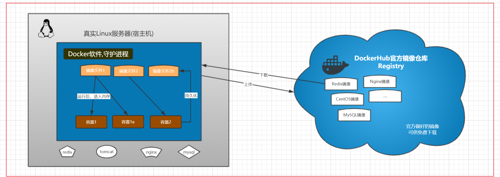
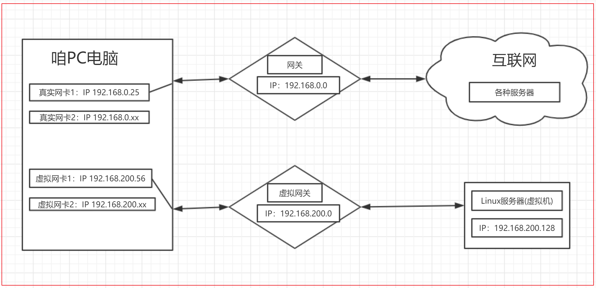
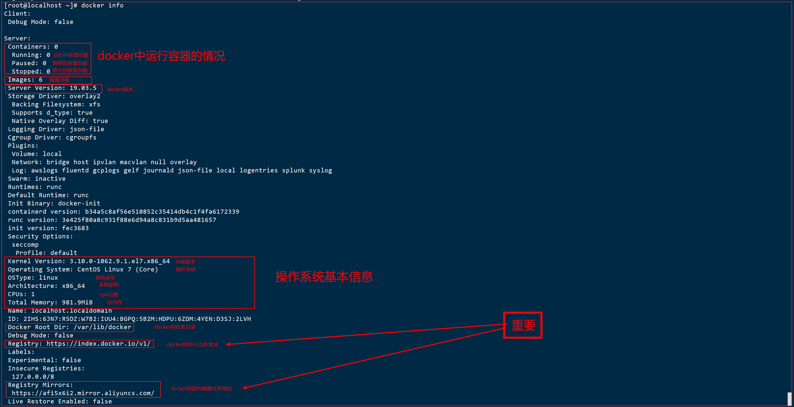
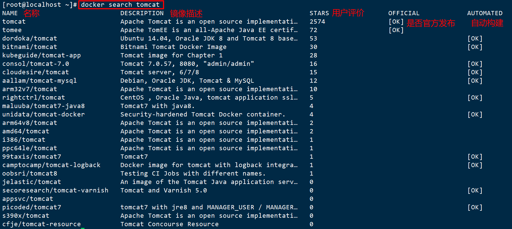
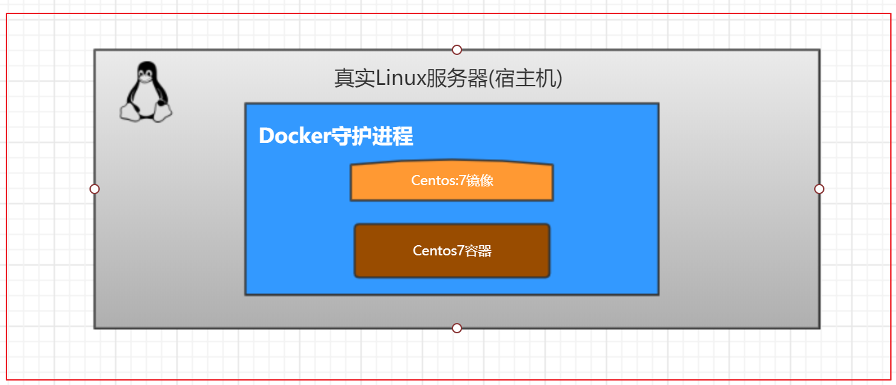

# 今日授课目标

1. 能够在Centos7操作系统中安装Docker
4. 能够启动、停止、重启docker服务
5. 能够搜索镜像、查看镜像、拉取镜像、删除镜像
6. 能够查看、启动、停止容器
7. 能够理解数据卷的概念及配置数据卷
8. 能够基于Docker部署mysql、tomcat、redis
9. 能够备份docker中的容器
10. 能够搭建docker镜像仓库私服


# 一、Docker简介

## 1.1 虚拟化技术

虚拟化技术是一种资源管理技术，是将计算机的各种实体资源，如服务器、网络、内存及存储等，予以抽象、转换后呈现出来，打破实体结构间的不可切割的障碍，使用户可以比原本的组态更好的方式来应用这些资源。

虚拟化技术主要作用：==**高性能的物理硬件产能过剩**==、==**软件跨环境迁移问题(代码的水土不服)**==

## 1.2 什么是Docker

Docker 是一个开源的应用容器引擎

诞生于 2013 年初，基于 Go 语言实现， dotCloud 公司出品（后改名为Docker Inc）；

Docker 可以让开发者打包他们的应用以及依赖包到一个轻量级、可移植的容器中，然后发布到任何流行的 Linux 机器上。

容器是完全使用沙箱机制，相互隔离，容器性能开销极低。

Docker 从 17.03 版本之后分为 CE（Community Edition: 社区版） 和 EE（Enterprise Edition: 企业版）

官网地址：https://www.Docker.com

​	

Docker通俗的讲，是**服务器中高性能的虚拟机**，可以将一台物理机虚拟N多台虚拟机的机器，互相之间隔离，互不影响。

**特点：**

- 容器将应用打包成标准化单元，用于交付、部署；
- 容器及包含了软件运行所需的所有环境，而且非常轻量级
- 容器化的应用程序，可以在任何Linux环境中始终如一的运行
- 容器化的应用程序，具备隔离性，这样多团队可以共享同一Linux系统资源


## 1.3 容器与虚拟机比较

下面的图片比较了 Docker 和传统虚拟化方式的不同之处，可见容器是在操作系统层面上实现虚拟化，直接复用本地主机的操作系统，而传统方式则是在硬件层面实现。


| 特性       | 容器               | 虚拟机         |
| ---------- | ------------------ | -------------- |
| 启动       | 秒级               | 分钟级         |
| 硬盘使用   | 一般为MB           | 一般为GB       |
| 性能       | 接近原生硬件       | 弱鸡           |
| 系统支持量 | 单机可跑几十个容器 | 单机几个虚拟OS |
| 运行环境   | 主要在Linux        | 主要在window   |

相同：容器和虚拟机都是虚拟化技术，具备资源隔离和分配优势

不同：

- 容器虚拟化的是操作系统，虚拟机虚拟化的是硬件
- 传统虚拟机可以运行不同的操作系统，容器主要运行同一类操作系统(Linux)

## 1.4 Docker 基本概念



**宿主机：**安装Docker守护进程的Linux服务器，称之为宿主机；

**镜像（Image）：**Docker 镜像，就相当于是一个 root 文件系统。比如官方镜像 ubuntu:16.04 就包含了完整的一套 Ubuntu16.04 最小系统的 root 文件系统。

**容器（Container）：**镜像运行之后的实体，镜像和容器的关系，就像是面向对象程序设计中的类和对象一样，镜像是静态的定义，容器是镜像运行时的实体。容器可以被创建、启动、停止、删除、暂停等。

**仓库（Repository）：**仓库可看成一个代码控制中心，用来保存镜像。

# 二、Docker安装与启动

安装之前进行虚拟机网卡配置



## 2.1 安装

Docker官方建议在Ubuntu中安装，因为Docker是基于Ubuntu发布的，而且一般Docker出现的问题Ubuntu是最先更新或者打补丁的。在很多版本的CentOS中是不支持更新最新的一些补丁包的。

由于我们学习的环境都使用的是CentOS，因此这里我们将Docker安装到CentOS上。注意：这里建议安装在CentOS7.x以上的版本，在CentOS6.x的版本中有Bug！

>  请直接挂载课程配套的Centos7.x镜像	

（1）yum 包更新到最新

```powershell
sudo yum update
```

（2）安装需要的软件包， yum-util 提供yum-config-manager功能，另外两个是devicemapper驱动依赖的

```shell
sudo yum install -y yum-utils device-mapper-persistent-data lvm2
```

（3）设置yum源为阿里云

```shell
sudo yum-config-manager --add-repo http://mirrors.aliyun.com/docker-ce/linux/centos/docker-ce.repo
```

（4）安装docker

```shell
sudo yum install docker-ce
```

（5）安装后查看docker版本

```shell
docker -v
```


## 2.2 Docker守护进程相关命令

**systemctl**命令是系统服务管理器指令

启动docker：

```shell
systemctl start docker
```

停止docker：

```shell
systemctl stop docker
```

重启docker：

```shell
systemctl restart docker
```

查看docker状态：

```shell
systemctl status docker
```

开机启动：

```shell
systemctl enable docker
```

查看docker概要信息

```shell
docker info
```



查看docker帮助文档

```shell
docker --help
```

## 2.3 镜像加速

默认情况，将从docker hub（https://hub.docker.com/）下载docker镜像太慢，一般都会配置镜像加速器；

中国科学技术大学(ustc)是老牌的linux镜像服务提供者了，还在遥远的ubuntu 5.04版本的时候就在用。ustc的docker镜像加速器速度很快。ustc docker mirror的优势之一就是不需要注册，是真正的公共服务。

[https://lug.ustc.edu.cn/wiki/mirrors/help/docker](https://lug.ustc.edu.cn/wiki/mirrors/help/docker)

编辑该文件：

```shell
vim /etc/docker/daemon.json  
```

在该文件中输入如下内容：

```shell
{
"registry-mirrors": ["https://docker.mirrors.ustc.edu.cn"]
}
```

如果中科大镜像加载速度很慢，建议配置阿里云镜像加速，这个镜像仓库如果不好使，可以自己从阿里云上申请！速度杠杠的~

```shell
{
  "registry-mirrors": ["https://3ad96kxd.mirror.aliyuncs.com"]
}
```

必须要注册，每个人分配一个免费的docker镜像加速地址，速度极快

配置完成记得刷新配置

```shell
sudo systemctl daemon-reload
sudo systemctl restart docker
```

# 三、Docker中常用命令

## 3.1 镜像相关命令

### 3.1.1 查看镜像

查看本地所有镜像

```shell
docker images
```


这些镜像都是存储在Docker宿主机的/var/lib/docker目录下

### 3.1.2 搜索镜像

如果你需要从网络中查找需要的镜像，可以通过以下命令搜索；**==注意，必须确保当前系统能联网==**

```shell
docker search 镜像名称
```



### 3.1.3 拉取镜像

拉取镜像:从Docker仓库下载镜像到本地，镜像名称格式为 名称:版本号，如果版本号不指定则是最新的版本。如果不知道镜像版本，可以去docker hub 搜索对应镜像查看。

```shell
docker pull 镜像名称
```

例如，我要下载centos7镜像

```shell
docker pull centos:7
```

### 3.1.4 删除镜像

按镜像ID删除镜像

```shell
docker rmi 镜像ID
```

删除所有镜像

```shell
docker rmi `docker images -q`
```

## 3.2 容器相关命令

### 3.2.1 查看容器

查看正在运行的容器

```shell
docker ps
```

查看所有容器

```shell
docker ps –a
```

查看最后一次运行的容器

```shell
docker ps –l
```

查看停止的容器

```shell
docker ps -f status=exited
```

### 3.2.2 创建与启动容器


创建容器命令：

```
docker run 参数 镜像名称:镜像标签 /bin/bash
```

创建容器常用的参数说明：

```shell
## 命令参数详解
-i：表示运行容器

-t：表示容器启动后会进入其命令行。加入这两个参数后，容器创建就能登录进去。即分配一个伪终端(如果只加it两个参数，创建后就会自动进去容器)。
 
-d：在run后面加上-d参数,则会创建一个守护式容器在后台运行（这样创建容器后不会自动登录容器）。
 
--name :为创建的容器命名。

-v：表示目录映射关系（前者是宿主机目录，后者是映射到宿主机上的目录），可以使用多个－v做多个目录或文件映射。注意：最好做目录映射，在宿主机上做修改，然后共享到容器上。

-p：表示端口映射，前者是宿主机端口，后者是容器内的映射端口。可以使用多个-p做多个端口映射

进入容器之后，初始化执行的命令：/bin/bash；可写可不写
```

#### （1）交互式容器

```shell
docker run -it --name=容器名称 镜像名称:标签 /bin/bash
```

这时我们通过ps命令查看，发现可以看到启动的容器，状态为启动状态


退出当前容器

```shell
exit
```

#### （2）守护式容器：

```shell
docker run -di --name=容器名称 镜像名称:标签 /bin/bash
```

#### （3）登录容器：

```shell
docker exec -it 容器名称 (或者容器ID)  /bin/bash
```

**注意：这里的登陆容器之后执行的脚本/bin/bash必须写**

### 3.2.3 停止与启动容器

停止容器：

```shell
docker stop 容器名称（或者容器ID）
```

启动容器：

```shell
docker start 容器名称（或者容器ID）
```

### 3.2.4 文件拷贝



如果我们需要将文件拷贝到容器内可以使用cp命令

```shell
docker cp 需要拷贝的文件或目录 容器名称:容器目录
```

也可以将文件从容器内拷贝出来

```shell
docker cp 容器名称:容器目录 需要拷贝的文件或目录
```

### 3.2.6 查看容器IP地址

我们可以通过以下命令查看容器运行的各种数据

```shell
docker inspect 容器名称（容器ID） 
```


也可以直接执行下面的命令直接输出IP地址

```shell
docker inspect --format='{{.NetworkSettings.IPAddress}}' 容器名称（容器ID）
```

### 3.2.7 删除容器 

删除指定的容器，正在运行的容器无法删除

```shell
docker rm 容器名称（容器ID）
```


# 四、Docker数据卷

## 4.1 数据卷概述

**解决的问题：**

> 考虑到容器的隔离性：
>
> Docker 容器删除之后，在容器中产生的数据还在吗？
>
> Docker 容器和外部机器可以直接交换文件吗？
>
> 容器之间的数据交互？

数据卷是宿主机中的一个目录或文件，当容器目录和数据卷目录绑定后，对方的修改会立即同步；一个数据卷可以被多个容器同时挂载，一个容器也可以被挂载多个数据卷

**数据卷作用**

- 容器数据持久化
- 外部机器和容器间接通信
- 容器之间数据交换

## 4.2 数据卷配置方式

### (1).1个容器挂载1个数据卷

创建启动容器时，使用 –v 参数 设置数据卷

```shell
docker run ... –v 宿主机目录(文件):容器内目录(文件) ... 
```

注意事项：

   1. 目录必须是绝对路径

2. **如果宿主机目录不存在，会自动创建**

3. 可以挂载多个数据卷

案例：

```shell
docker run -di --name=c1 -v /root/host_data1:/root/c1_data centos:7 /bin/bash
```


### (2).查看容器已挂载的数据卷

我们可以通过以下命令，查看容器中挂载的数据卷

```
docker inspect 容器名称（容器ID） 
```


### (3).1个容器挂载多个数据卷

我们可以通过以下命令，挂载多个数据卷

```shell
docker run -di --name=c1 -v /root/host_data1:/root/c1_data1 -v /root/host_data2:/root/c1_data2 centos:7 /bin/bash
```

### (4).多个容器挂载1个数据卷

多个容器挂载1个数据卷，实现数据共享

```shell
docker run -di --name=c2  -v /root/host_data_common:/root/c2_data centos:7
docker run -di --name=c3  -v /root/host_data_common:/root/c3_data centos:7
```


多个容器挂载1个容器(这个容器挂载1个数据卷)

````shell
##创建启动c3数据卷容器，使用 –v 参数 设置数据卷
docker run -it --name=c3 -v /root/host_data_common:/root/c3_data centos:7 /bin/bash
##创建启动 c1 c2 容器，使用 –-volumes-from 参数 设置数据卷
docker run -it --name=c1 --volumes-from c3 centos:7 /bin/bash
docker run -it --name=c2 --volumes-from c3 centos:7 /bin/bash
````


# 五、在Docker中部署应用

## 5.1 MySQL部署

### **实现步骤：**

1. 搜索MySQL镜像
2. 拉取MySQL镜像
3. 创建容器、设置端口映射、设置数据卷
4. 进入容器操作mysql
5. 使用Navicat连接MySQL

### **实现过程：**

1. 搜索mysql镜像

```shell
docker search mysql
```

2. 拉取mysql镜像

```shell
docker pull mysql:8.0.29
```

3. 创建容器，设置端口映射、目录映射

```shell
docker run -di --name=mysql -p 3306:3306 -v /root/mysql/logs:/logs -v /root/mysql/data:/var/lib/mysql -e MYSQL_ROOT_PASSWORD=123456 mysql:8.0.29
```

- 参数说明：
  - **-p 3307:3306**：将容器的 3306 端口映射到宿主机的 3307 端口。
  - **-v /root/mysql/logs:/logs**：将主机目录(/root/mysql)下的 logs 目录挂载到容器中的 /logs。日志目录
  - **-v /root/mysql/data:/var/lib/mysql** ：将主机目录(/root/mysql)下的data目录挂载到容器的 /var/lib/mysql 。数据目录
  - **-e MYSQL_ROOT_PASSWORD=123456：**初始化 root 用户的密码。

4. 进入容器，操作mysql

```shell
docker exec –it c_mysql /bin/bash
```

5. 使用Navicat连接容器中的mysql

 ## 5.2 Tomcat部署

### **实现步骤：**

1. 搜索Tomcat镜像
2. 拉取Tomcat镜像
3. 创建容器、设置端口映射、设置数据卷
4. 向Tomcat中部署服务
5. 使用外部机器访问Tomcat，测试部署服务

### **实现过程：**

1. 搜索tomcat镜像

```shell
docker search tomcat
```

2. 拉取tomcat镜像

```shell
docker pull tomcat:8-就热1
```

3. 创建容器，设置端口映射、目录映射

```shell
docker run -id --name=c_tomcat -p 8080:8080 -v /root/tomcat/webapps:/usr/local/tomcat/webapps tomcat:8-jdk8
```

- 参数说明：

  - **-p 8080:8080：**将容器的8080端口映射到主机的8080端口

    **-v /root/tomcat/webapps:/usr/local/tomcat/webapps：**将主机目录(/root/tomcat/webapps)挂载到容器的webapps

4. 向Tomcat中部署服务，使用FinalShell文件上传
5. 使用外部机器访问Tomcat，测试部署服务

## 5.3 Redis部署

### **实现步骤：**

1. 搜索Redis镜像
2. 拉取Redis镜像
3. 创建容器、设置端口映射
4. 使用外部机器连接Redis，测试

### **实现过程：**

1. 搜索redis镜像

```shell
docker search redis
```

2. 拉取redis镜像

```shell
docker pull redis:6.2.6
```

3. 创建容器，设置端口映射

```shell
docker run -id --name=redis -p 6379:6379 redis:6.2.6 --requirepass “password”
```

4. 使用外部机器连接redis，测试

# 六、制作Docker镜像

## 6.1 镜像原理

> Docker 镜像本质是什么？
>
> Docker 中一个centos镜像为什么只有200MB，而一个centos操作系统的iso文件要几个个G？
>
> Docker 中一个tomcat镜像为什么有500MB，而一个tomcat安装包只有70多MB？
>
> 查PPT

Docker 镜像本质其实是一个分层的统一文件系统（union file system）

## 6.2 迁移与备份

### 1、容器保存为镜像

我们可以通过以下命令将容器保存为镜像

```shell
docker commit {正在运行容器名称} {镜像名称}
# 举例
docker commit c_tomcat mywar_tomcat
```

### 2、镜像备份

我们可以通过以下命令将镜像保存为tar 文件

```shell
docker save -o {镜像的备份文件} {镜像名称}
# 举例
docker save -o mywar_tomcat.tar mywar_tomcat
# -o :输出到的文件
```

### 3、镜像恢复与迁移

首先我们先删除掉mynginx_img镜像  然后执行此命令进行恢复

```shell
docker load -i {备份的镜像文件}
# 举例
docker load -i mywar_tomcat.tar
# -i :指定导入的文件
```

执行后再次查看镜像，可以看到镜像已经恢复，可以再次运行测试

```shell
docker run -di --name=mytomcat -p 8081:8080 -v /root/tomcat/webapps/:/usr/local/tomcat/webapps mywar_tomcat:latest
```

## 6.3 Dockerfile简介

Dockerfile 是一个文本文件，包含了构建镜像文件的指令，每一条指令构建一层，基于基础镜像，最终构建出一个新的镜像；

- 对于开发人员：可以为开发团队提供一个完全一致的开发环境

- 对于测试人员：可以直接拿开发时所构建的镜像或者通过Dockerfile文件构建一个新的镜像，直接开始工作

- 对于运维人员：在部署时，可以实现应用的无缝移植

**关键字：**

| 关键字      | 作用                     | 备注                                                         |
| ----------- | ------------------------ | ------------------------------------------------------------ |
| FROM        | 指定父镜像               | 指定dockerfile基于那个image构建                              |
| MAINTAINER  | 作者信息                 | 用来标明这个dockerfile谁写的                                 |
| LABEL       | 标签                     | 用来标明dockerfile的标签 可以使用Label代替Maintainer 最终都是在docker image基本信息中可以查看 |
| RUN         | 执行命令                 | 执行一段命令 默认是/bin/sh 格式: RUN command 或者 RUN ["command" , "param1","param2"] |
| CMD         | 容器启动命令             | 提供启动容器时候的默认命令 和ENTRYPOINT配合使用.格式 CMD command param1 param2 或者 CMD ["command" , "param1","param2"] |
| ENTRYPOINT  | 入口                     | 一般在制作一些执行就关闭的容器中会使用                       |
| COPY        | 复制文件                 | build的时候复制文件到image中                                 |
| ADD         | 添加文件                 | build的时候添加文件到image中 不仅仅局限于当前build上下文 可以来源于远程服务 |
| ENV         | 环境变量                 | 指定build时候的环境变量 可以在启动的容器的时候 通过-e覆盖 格式ENV name=value |
| ARG         | 构建参数                 | 构建参数 只在构建的时候使用的参数 如果有ENV 那么ENV的相同名字的值始终覆盖arg的参数 |
| VOLUME      | 定义外部可以挂载的数据卷 | 指定build的image那些目录可以启动的时候挂载到文件系统中 启动容器的时候使用 -v 绑定 格式 VOLUME ["目录"] |
| EXPOSE      | 暴露端口                 | 定义容器运行的时候监听的端口 启动容器的使用-p来绑定暴露端口 格式: EXPOSE 8080 或者 EXPOSE 8080/udp |
| WORKDIR     | 工作目录                 | 指定容器内部的工作目录 如果没有创建则自动创建 如果指定/ 使用的是绝对地址 如果不是/开头那么是在上一条workdir的路径的相对路径 |
| USER        | 指定执行用户             | 指定build或者启动的时候 用户 在RUN CMD ENTRYPONT执行的时候的用户 |
| HEALTHCHECK | 健康检查                 | 指定监测当前容器的健康监测的命令 基本上没用 因为很多时候 应用本身有健康监测机制 |
| ONBUILD     | 触发器                   | 当存在ONBUILD关键字的镜像作为基础镜像的时候 当执行FROM完成之后 会执行 ONBUILD的命令 但是不影响当前镜像 用处也不怎么大 |
| STOPSIGNAL  | 发送信号量到宿主机       | 该STOPSIGNAL指令设置将发送到容器的系统调用信号以退出。       |
| SHELL       | 指定执行脚本的shell      | 指定RUN CMD ENTRYPOINT 执行命令的时候 使用的shell            |

## 6.4 将springboot的可执行jar包制作为docker镜像

**目标：发布springboot项目到docker容器中**


注意：构建docker镜像的是Dockerfile文件，Dockerfile文件与SpringBoot文件必须存放在同一个目录；

**实现步骤：**

1. 在IDEA中编辑Dockerfile文件
   - 定义基础镜像
   - 定义作者信息
   - 向镜像中添加jar包文件
   - 定义当前镜像启动容器时，执行命令
2. 在宿主机中，构建镜像，用到docker命令
3. 基于镜像，启动容器
4. 测试

**实现过程：**

1. 在IDEA中编辑Dockerfile文件

   - ```dockerfile
     # 定义基础镜像
     FROM java:8
     # 定义作者信息
     MAINTAINER  itheima-hero-brother <itheima@itcast.cn>
     # 添加jar包文件到镜像中
     ADD springboot.jar app.jar
     # 定义当前镜像启动容器时，执行命令
     CMD java –jar app.jar
     ```

2. 在宿主机中，构建镜像

   - ```shell
     docker bulid –f {dockerfile的文件路径} –t {镜像名称:版本} {构建文件所在路径}
     # 举例
     docker build -f Dockerfile -t myspringboot:1.0 ./
     # -f:指定要使用的Dockerfile路径；
     # -t:镜像的名字及标签，通常 name:tag 或者 name 格式,不设置为latest
     ```

3. 基于镜像，启动容器

   ```shell
   docker run -di --name=myspringboot -p 9000:8080 myspringboot:1.0
   ```

4. 测试

# 七、搭建Docker私服

Docker官方的Docker hub（https://hub.docker.com）是一个用于管理公共镜像的仓库，我们可以从上面拉取镜像到本地，也可以把我们自己的镜像推送上去。但是，有时候我们的服务器无法访问互联网，或者你不希望将自己的镜 像放到公网当中，那么我们就需要搭建自己的私有仓库来存储和管理自己的镜像。

## 8.1 私有仓库搭建

### **实现步骤：**

1、拉取私有仓库镜像

2、启动私有仓库容器  

3、测试私有镜像仓库是否搭建成功

4、配置私有仓库

5、重启docker服务

### **实现过程：**

1、拉取私有仓库镜像 

```shell
docker pull registry
```

2、启动私有仓库容器 

```shell
docker run -di --name=my_registry -p 5000:5000 registry:latest
```

3、测试私有镜像仓库是否搭建成功

- 打开浏览器 输入地址http://192.168.200.128:5000/v2/_catalog
- 看到{"repositories":[]} 表示私有仓库搭建成功

4、配置私有仓库

```shell
# 修改daemon.json   
vim /etc/docker/daemon.json    
# 在上述文件中添加一个key，保存退出
# 此步用于让 docker 信任私有仓库地址；注意将私有仓库服务器ip修改为自己私有仓库服务器真实ip 
{
"insecure-registries":["私有仓库服务器ip:5000"]
}
```

```shell
# 举例
{
"insecure-registries":["192.168.200.128:5000"]
}
```

5、重启docker服务

```shell
systemctl restart docker
docker start my_registry
```

## 8.2 将镜像上传至私有仓库

1、标记镜像为私有仓库的镜像     

```shell
# docker tag {镜像名称：标签} {私有仓库host:port}/{私有镜像仓库中的名称：标签}
# 举例
docker tag myspringboot:1.0 192.168.200.128:5000/springboot:1.0
```

 2、上传标记的镜像   

```shell
# docker push {私有仓库host:port}/{私有镜像仓库中的名称：标签}
# 举例
docker push 192.168.200.128:5000/springboot:1.0
```

## 8.3 从私有仓库拉取镜像

```shell
# 拉取镜像 
docker pull {私有仓库host:port}/{私有镜像仓库中的名称：标签}
# 举例
docker pull 192.168.200.128:5000/springboot:1.0
```


# 总结：

1. 能够在Centos7操作系统中安装Docker：不需要做，已经完成
2. 能够使用命令操作docker
   - docker守护进程：启动docker，停止，容器，开机自启，查看docker基本信息
   - docker中镜像的操作：搜索镜像，拉取镜像，删除镜像(一次性删除所有)
   - docker中容器的操作：查看容器、运行容器(run，交互式容器、守护式容器)、进入容器、运行容器、停止容器、删除容器、查看容器的基本信息(docker inspect)
3. 能够理解数据卷的概念及配置数据卷
   - 什么是数据卷：容器之间，容器与宿主机之间的，文件共享的目录(文件夹)
   - 配置数据(run -v)
   - 一个容器挂载一个数据卷
   - 一个容器挂载多个数据卷
   - 多个容器挂载同一个数据卷
   - 多个容器挂载一个数据卷容器，从而挂载一个数据卷
4. 能够基于Docker部署mysql、tomcat、redis
   - mysql ==本质docker run
   - tomcat
   - redis
5. 能够备份docker中的容器
   - 容器保存为镜像
   - 镜像文件打包tar传输
   - 基于tar文件，加载成为镜像